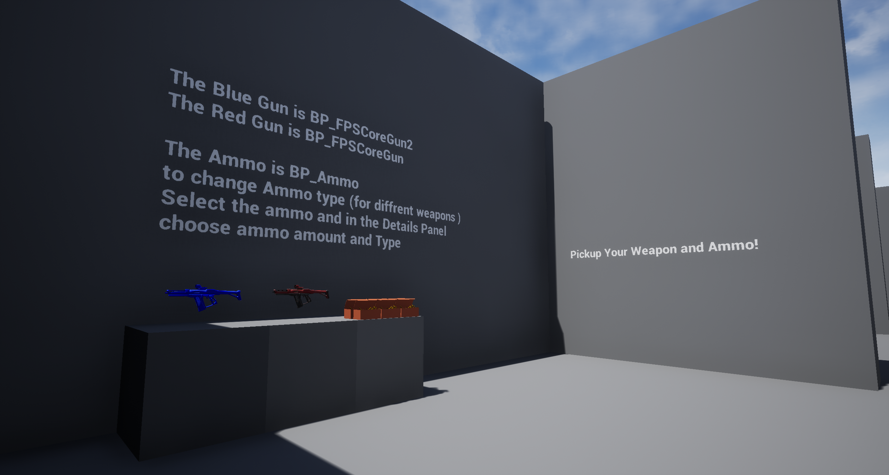
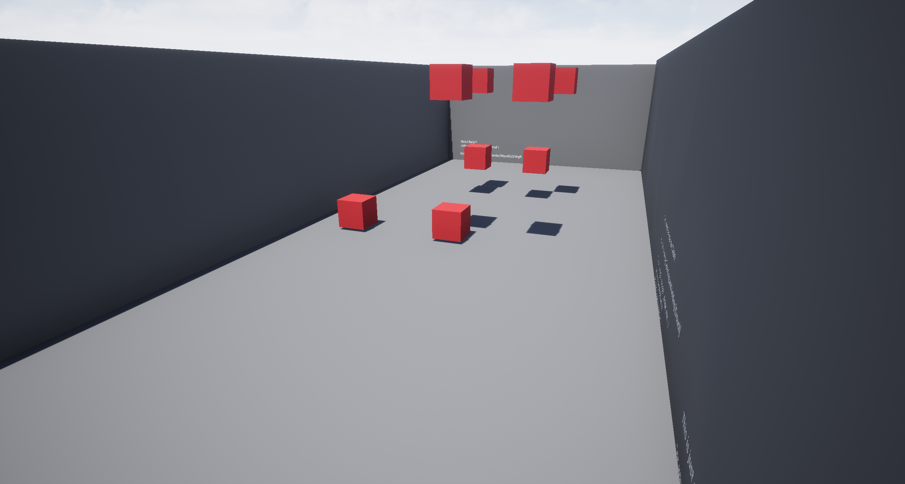
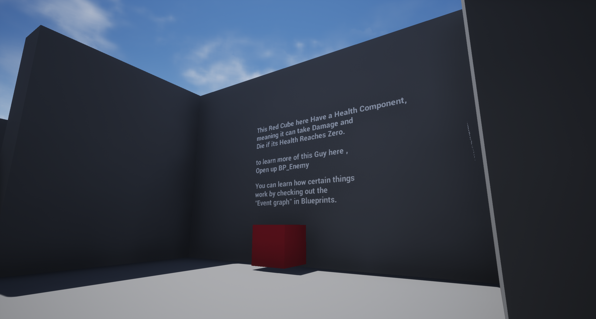

Thanks to community member @SPETSNAZ#2218, you can download a sample of FPS Core below!

[FPS Core Community Sample (4.27)](https://emmadocs.dev/wp-content/uploads/2022/12/FPSCoreCommunitySample4_27.zip)[Download](https://emmadocs.dev/wp-content/uploads/2022/12/FPSCoreCommunitySample4_27.zip)

[FPS Core Community Sample (5.0)](https://emmadocs.dev/wp-content/uploads/2022/12/FPSCoreCommunitySample5_0.zip)[Download](https://emmadocs.dev/wp-content/uploads/2022/12/FPSCoreCommunitySample5_0.zip)

[FPS Core Community Sample (5.1)](https://emmadocs.dev/wp-content/uploads/2023/03/FPSCoreCommunitySample5_1.zip)[Download](https://emmadocs.dev/wp-content/uploads/2023/03/FPSCoreCommunitySample5_1.zip)

> Please note that this is not an official sample pack, and I am unable to offer any official support for it, be that here or on the community discord server. Thank you for your understanding.
> 
> The sample is provided by SPETSNAZ under an MIT License. This means that it is provided without warranty, and he is under no obligation to provide any support or updates for this asset.

Thanks again to SPETSNAZ for his work!
