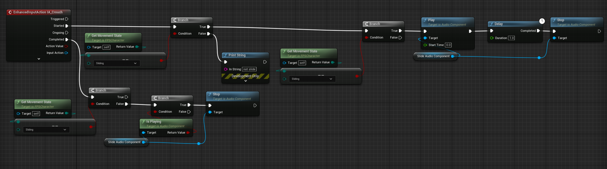

> The knowledge in this guide comes courtesy of community member Laud#3724 on discord! Thanks to them for figuring this out and letting me share it :D

Natively, FPS Core doesn't yet support custom events that follow certain actions. However, if you'd like to add a custom sliding sound, this guide might be able to help! You'll have to essentially hijack the input from the input node in your character!

From there, you're able to check that the state of the player and based on that, play the sound. Laud also added some code to make it so that the sliding sound stops playing in the event that the player stops sliding.

Without further ado, the code is below!

