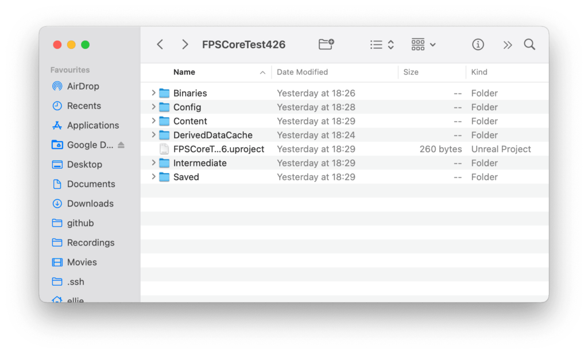
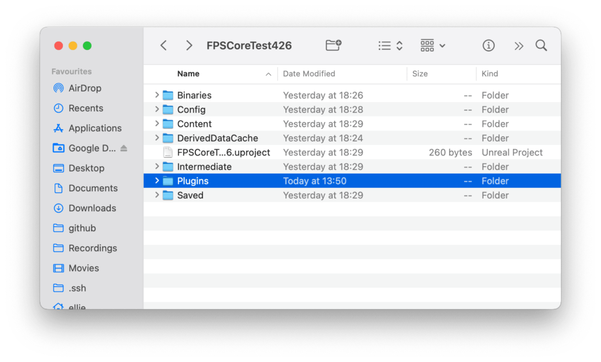
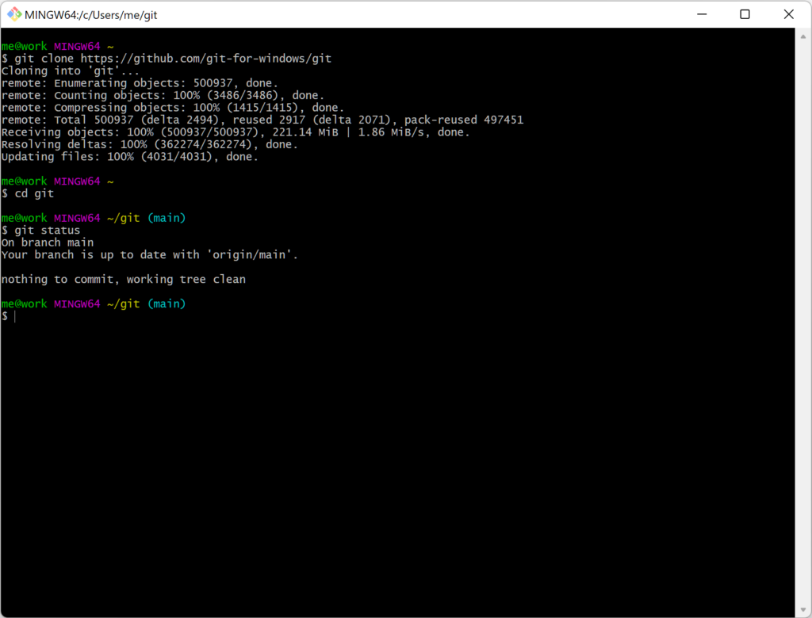
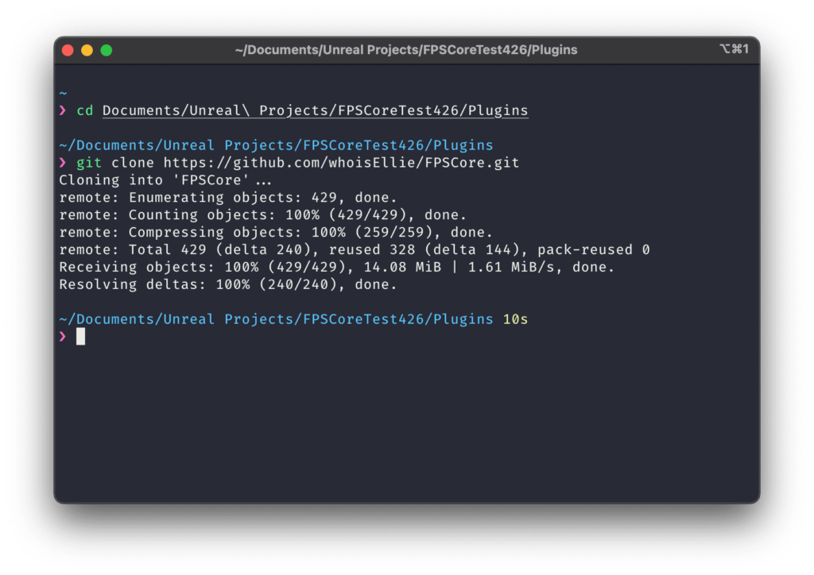
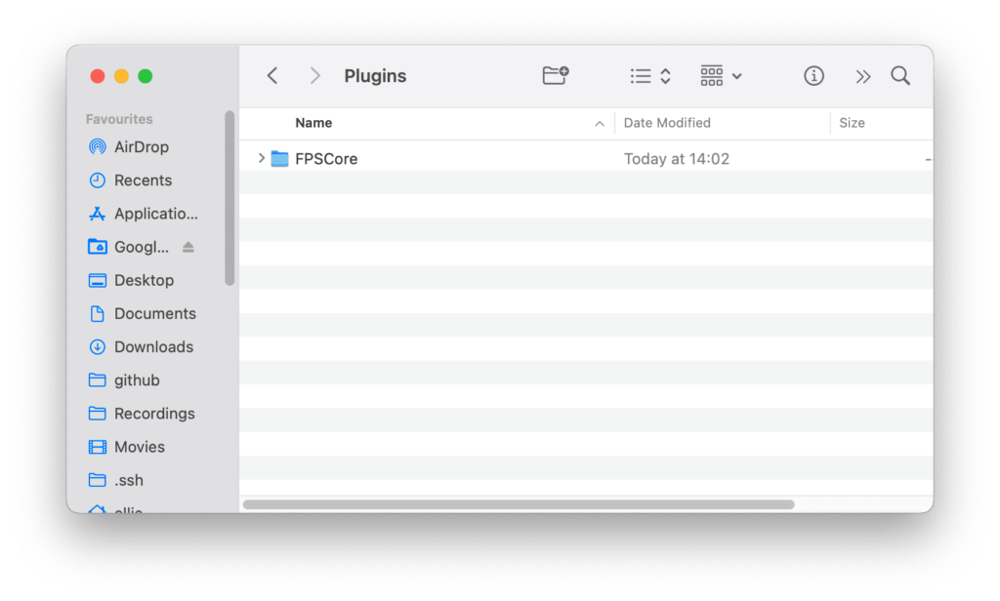
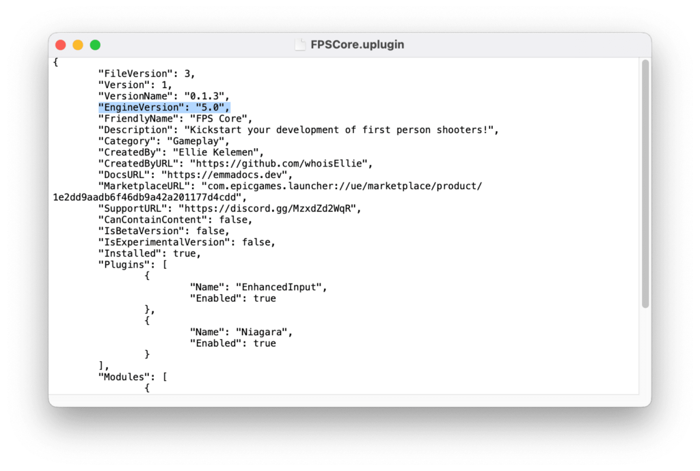
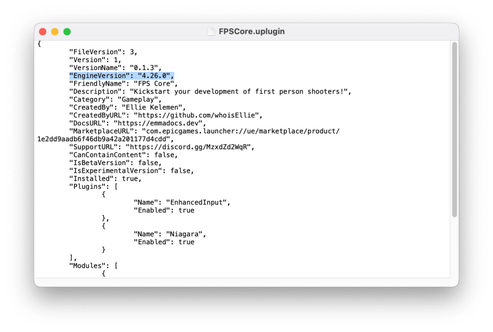
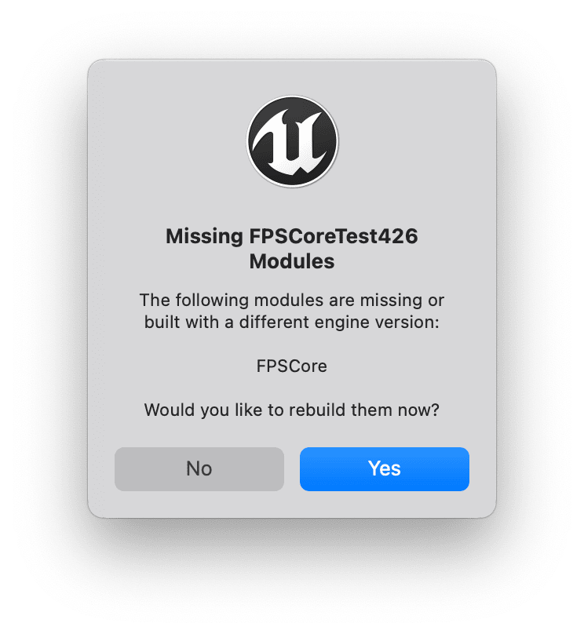
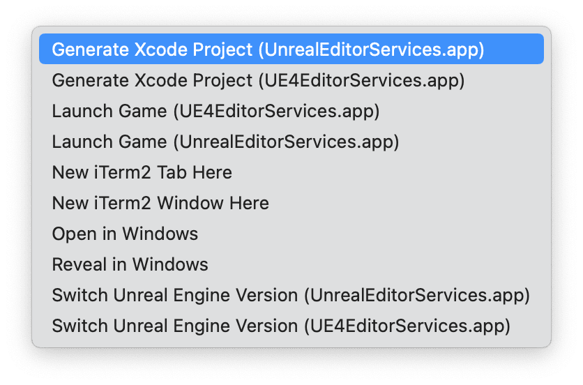

FPS Core is available on the marketplace, like most other plugins, and that is the recommended way of accessing it for most users. You're only going to be able to access the most stable updates, with completed and documented features.

However, some users, especially those comfortable with C++ may with to have a more direct, bleeding-edge version of FPS core running in their projects.

These so called 'nightly' builds are available from the FPS Core [github page](https://github.com/whoisEllie/FPSCore). In this guide, I'll walk you through setting up git, and cloning the FPS Core github repository in order to stay as up to date as possible with FPS Core development.

## Git

If you're already familiar with git, you're welcome to skip this section. For those who are not, git is a version control system used by FPS Core that allows me to push my updates to a central repository. Once enough features have been added (and certain bugs fixed), i'll package the plugin, separate the versions, and send them to epic to be uploaded to the marketplace.

To install git, simply head to [https://git-scm.com](https://git-scm.com). This will let you download the most up-to-date version, though there are alternatives if you're using MacOS or Linux, thanks to their UNIX (-style) architecture and bash/zsh/etc. shells. On mac, you can use [Homebrew](https://brew.sh) to download git to the command line, and on linux you can use your package manager (apt, pacman, etc.) to do the same :)

Once you have git installed, we can move on to the next step!

## Cloning the FPS Core repository

Git provides us with a set of commands that we can use to 'clone' the FPS Core repository. This makes a local version on your computer that's bound to the public version that's available on github.

First though, we need to create our plugins folder. You can do this either for an engine version, or for a specific project. I'm going to be demonstrating this for a project, but you can also do this for an entire engine version if you'd like to. To do that, simply find your plugins folder in the `UE_ENGINEVERSION/Engine/Plugins` folder (for example, `/Users/Shared/Epic Games/UE4.26/Engine/Plugins` on my mac).

If you're doing it in a project, first navigate to the project directory. Here, you'll notice the distinct lack of a plugins folder (at least, if this is a new project).

No worries though, we can simply create one :)

Using either your file browser or the `mkdir` command, add a folder to the project directory called `Plugins`.

Now that we have our plugins folder, let's actually clone the repository. For this, you will need a git shell. If you installed git for windows, you should be able to right click in your file browser and see the option 'git bash here'. That should open a small terminal that looks something like this:

<figure>

<figcaption>

Image taken from https://gitforwindows.org

</figcaption>

</figure>

If you're on macos or linux, we'll be using the shell that's available to us. You'll need to use the `cd` command to get to the plugins folder. Once you've either opened the git bash in the plugins folder, or gotten there through the `cd` command, we need to run a simple command.

`git clone https://github.com/whoisEllie/FPSCore.git`

You'll see the git command run and clone the FPS Core repository, and now, if you look into the Plugins folder (or run the `ls` command), you'll see FPS Core!

## Changing the engine version

The main FPS Core repository is targeted for Unreal Engine version 5.0. If you're using it for another supported version (Like 4.27 or 4.26), you'll have to update the version identifier in the plugin's descriptor file.

Doing this is simple - just open the `FPS Core` folder and find FPS`Core.uplugin`, then open it in your text editor of choice. We just need to change the line that says `"Engine Version": "5.0",`

Naturally, you change this to the version of Unreal that you are using. In my case, 4.26:

## Missing modules

If you're not running the engine from an IDE (Rider/Visual Studio/XCode/etc.), then when you go to launch your project now, you'll most likely get a message that reads:

Don't worry, this is totally expected! Just click `Yes`, and the engine should rebuilt the module with the built-in `UnrealBuiltTool`. If this fails, you may need to launch the project through an IDE and compile through there. Also note that releases pushed to the github repository are not necessarily bug-free and do not need to compile.

## FPS Core isn't showing up in my IDE!

If you already had C++ project files generated, you may find that upon launching your IDE, you cannot actually see the plugins folder or FPS Core. This is because Unreal has not actually acknowledged the existence of the plugin folder yet - to get it to do this, we simply need to regenerate our project files. Right click on the .uproject file, and hit the '(Re)generate \[IDE\] Project (Files)' option. For me on mac, that looks like this:

That should fix it, and you should see your new plugin in your IDE!

## Updating to the latest version

Now that you have the plugin in your project and linked to git, you're also able to update to the most recent update at any time very easily. Basically, you'll be repeating the steps in the section about [Cloning](#cloning), but instead of running the `git clone https://github.com/whoisEllie/FPSCore.git` command, you'll simply run `git pull`. This will update your repository with the most recent changes that i have uploaded to git :)

Most likely, you'll again be greeted by a 'missing modules' test or be forced to regenerate your project files in order to see the new changes in engine and in your IDE.

I hope that helps! If you've got questions or encountered issues, feel free to hop into the [discord support community](https://discord.gg/MzxdZd2WqR) to get direct help :)
