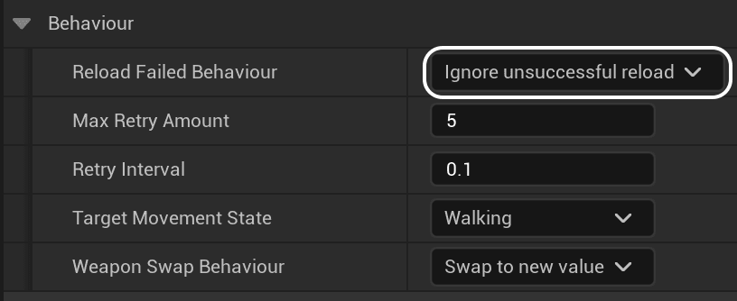
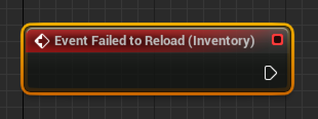

0.1.8

The most recent confirmed working version for this guide

With v0.1.5, FPS Core received a new set of features designed to give you more control over reloading behaviour. In this guide, we'll go over them, see how they can be used and how you can make the most of them for your project!

The reload behaviour options are designed to help you handle situations in which the player tries to reload, but cannot, most likely due to being in a movement state (such as sprinting) which does not allow reloading.

You'll find the settings for this under the `Weapons` tab of your `Inventory Component`. Here, you'll see a dropdown with 4 options.

Let's go through all the options one by one!  

## Ignore unsuccessful reload

This option is by far the most straightforward, and the given default for this category. It simply ignores any reload attempts that are blocked. It's simple, straightforward, and, well, not very useful. Internally, this simply does, well, nothing. If you want a bit more information, it simply breaks out of a switch statement.

## Retry until successful

When you choose to retry a reload until successful, an internal timer is set, after which it tries to reload again. If once again the request to reload isn't met, we try the timer again, doing so until we hit the `Max Retry Amount`. This is one of the most unobtrusive ways to handle failed reloads, since we wait for the player to be in a suitable reload state before we actually do anything, but still handle the actual reload instead of ignoring it.

You can customise this feature with the help of the `Max Retry Amount` and `Retry Interval` variables:

- `Max Retry Amount` defines the maximum amount of times we can try to reload after failure occurs. To retry indefinitely, we can set the amount to 0.

- `Retry Interval` is the time between each retry. By default, it's set to 0.1. You can raise this value, but it's not recommended to raise it much higher than 0.1, since this can feel unresponsive if, for example, the player stops sprinting, and half a second later their character reloads their weapon.

It is also worth noting that the reload retry timer is cleared whenever the player performs a weapon swap.

## Change movement state to be able to successfully reload

Force-changing the movement state is a bit of a blunt instrument, but the option remains should you choose to use it. This feature swaps the player's movement state to whatever is selected under the `Target Movement State` value. It's worth making sure that the player can reload in this situation, otherwise you face entering a situation where the player is constantly being reset to `Target Movement State`, which is undesirable.

## Handle in blueprint

Handle in blueprint doesn't deal with any internal logic. Rather, it simply passes an output to an event called `Failed to Reload`.

This node is called each time a reload fails, and this allows you to handle all sorts of fun custom behaviour, such as informing the player that they cannot reload while in the current movement state.

* * *

These options give you much greater flexibility when it comes to reloading, as well as greater control as you're now able to take matters into your own hands and run custom logic!
