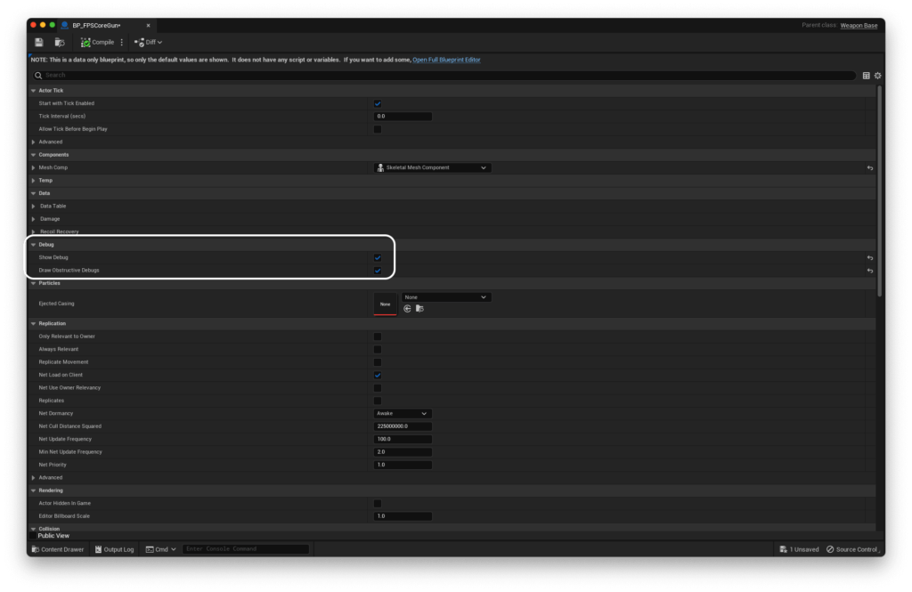
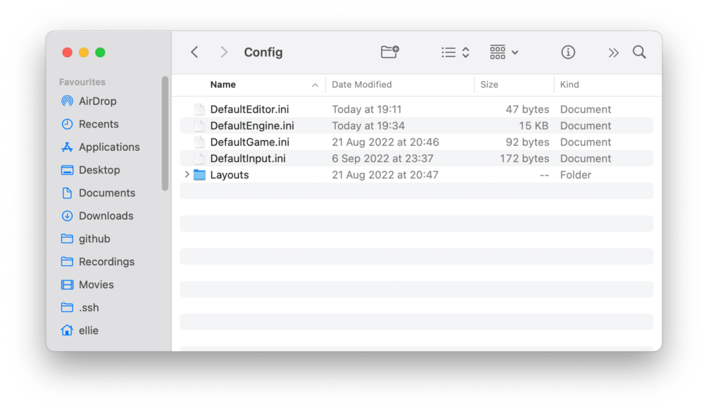
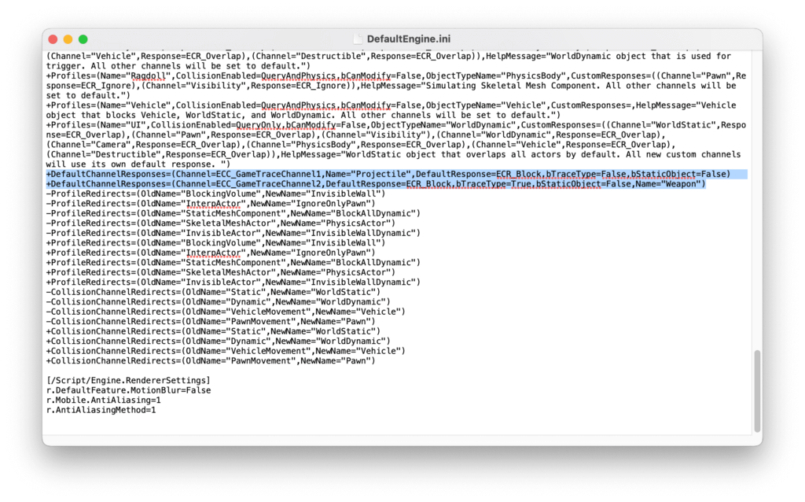
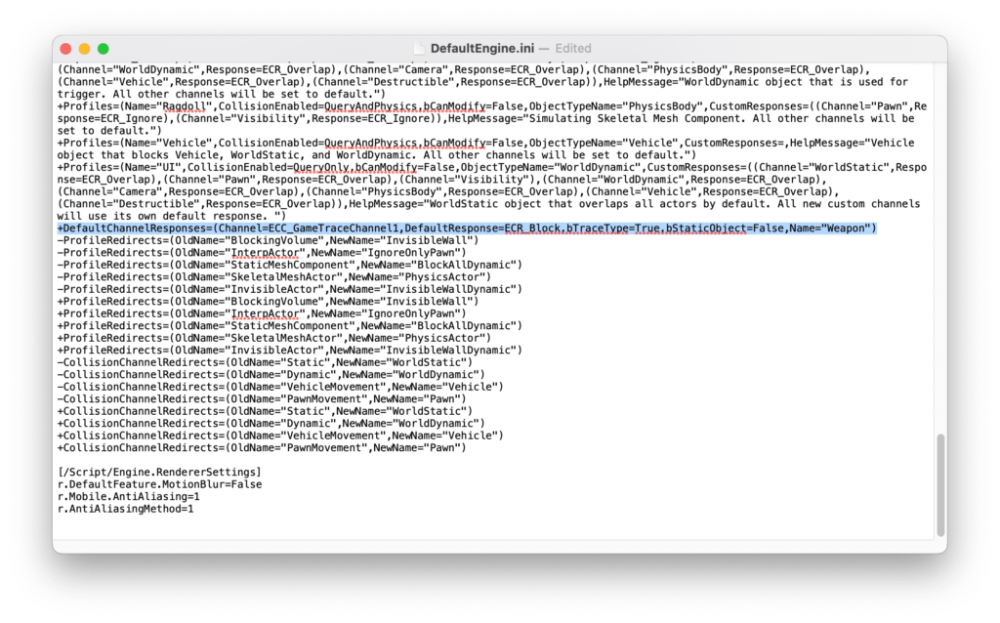

0.1.8

The most recent confirmed working version for this guide

In certain cases, it's possible that you might run into issues where it looks like your weapon isn't firing properly, even if you've done everything right when setting up the plugin.

The first thing to do is to open up your weapon blueprint. If you've come from [QuickStart! Part 4](https://emmadocs.dev/fps-core/quickstart-part-4-adding-weapons-and-animations/), you'll likely have called this `BP_FPSCoreGun`. Inside, enable `Show Debug` and `Draw Obstructive Debugs`.



Then, run your game. and try to shoot.

If you see something like this, your issue is with the `Weapon` trace's collision not being in the right channel. Let's fix that now!

To do this, we'll have to dive into some Unreal Engine configuration files. Head to your UE project folder and open the `Config` folder.

Inside, you'll find a combination of at least the 4 .ini files shown below, though there may be more depending on your version of Unreal, installed plugins, and what starter project you used.



Open up `DefaultEngine.ini` with your favourite text editor. You don't need an IDE here, something like Notepad on Windows and TextEdit on MacOS will work just fine. I'm going to use TextEdit.

Once opening it, we're going to look for lines that start with `+DefaultChannelResponses=(`. These declare how Unreal responds to any of it's built in `GameTraceChannel`s. In my case, I have two such declarations.



You can see that `ECC_GameTraceChannel1` is not assigned to `Weapon`, which is our issue, as FPS Core expects `GameTraceChannel1` to be free to use. To fix this, we can simply remove the whole line where the `ECC_GameTraceChannel1` trace (In this case, `Projectile`) is declared, and rename the `ECC_GameTraceChannel2` in our `Weapon` declaration to `ECC_GameTraceChannel1`. If you'd like, you can also just use `Projectile` (or whatever else you have occupying `GameTraceChannel1`) as a replacement for the `Weapon` channel, but for clarity this is not advised.

You should end up with a line in your `DefaultEngine.ini` that reads:

```
+DefaultChannelResponses=(Channel=ECC_GameTraceChannel1,DefaultResponse=ECR_Block,bTraceType=True,bStaticObject=False,Name="Weapon")
```



You can have other `+DefaultChannelResponse` declarations, as long as these do not take up `ECC_GameTraceChannel1`.

You'll have to restart the editor to apply these changes.

Hopefully, your weapons should now work as expected! If not, [hop into the community discord](https://discord.gg/MzxdZd2WqR) to get some help, or [email me](mailto:contact@emmadocs.dev)!
