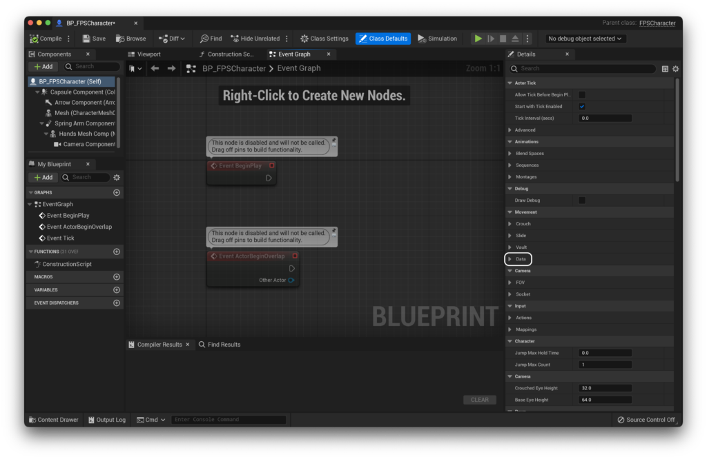

0.1.8

The most recent confirmed working version for this guide

If you're looking to get started with FPS Core as quickly as possible, you've come to the right place! This is the first in a series of writeups in which i'll teach you the basics of FPS Core, and how to get up and running with FPS Core as quickly as possible, so that you can focus on what matters - building your game!

## Creating our character

Our Character is the foundation of everything in our game. In FPS Core, you'll find a robust base character that includes all of the features that we need to elegantly manoeuvre around our world. Let's start by creating our character from the base class, `FPSCharacter`.

Right click in your content browser, and click 'Blueprint Class' in the popup to create a new blueprint.

You'll see a popup like this, you'll want to hit the 'All Classes' dropdown, and type 'FPS' in the input field that appears.

<figure>

<figcaption>

Don't worry if you don't see FPSCoreDevGameModeBase, this class only exists because my project is called 'FPSCoreDev'

</figcaption>

</figure>

You'll see two important classes, `FPS Character` and `FPS Character Controller`. For now, let's create a new blueprint from `FPS Character`. Just click on the `FPS Character` class and press the blue 'select' button that shows up. Then, name your character something informative, i like to use `BP_FPSCharacter` in order to stay in line with Unreal Engine's [Coding Standard](https://docs.unrealengine.com/4.27/en-US/ProductionPipelines/DevelopmentSetup/CodingStandard/). You'll end up with the blueprint in your content browser, looking something like this :)

For the time being, let's leave our Character alone, and create a Character Controller in order to go with them. It's the same process as described above, just create a child of `FPSCharacterController` instead.

You can name this one 'BP\_FPSCharacterController', of 'BP\_FPSCC' if you prefer.

<figure>

<figcaption>

You should have your two blueprints created now!

</figcaption>

</figure>

## Creating and updating a game mode

Now, let's create a game mode to store our character and their related character controller! The process is the same as the process to create our previous two blueprints, except this time we can use the common `Game Mode Base` blueprint.

If you're sticking with the Unreal naming scheme, you'll want to name this one `GM_YourProjectName`, so in my case, i'll just call it `GM_FPSCore`. Congratulations! That's all the classes we need to make today :)

Next, let's open our newly created game mode. In here, we're going to set up our default character and character controller, which you'll recognise are the same classes we created above!

Opening up your game mode, you'll be greeted by something like this. You'll notice that off to the right (in the default unreal view), we can see the Details panel, and up top 'Class Defaults' is highlighted blue. This means we're looking at the default values for this class, which is exactly what we want. You'll notice that the default values include both a 'Default Pawn Class' and a 'Player Controller Class'.

We can then set these to the classes we created, assigning 'Default Pawn Class' to `BP_FPSCharacter` and 'PlayerControllerClass' to `BP_FPSCharacterController`.

Compile and save, and then open your project setting (Edit -> Project Settings) and under 'Maps and Modes', set the default game mode to the game mode we just created, in my case, `GM_FPSCore`.

If you add a player start to your level now, you'll notice that although the player _does_ spawn, nothing really happens. This is because we have not set up our movement variables or our inputs.

## Setting up our movement variables

Let's start with the movement variables. These reside within our FPS Character blueprint. If you open it, you might be greeted by a screen like this.

If you are greeted by a screen like this, just click the 'Open Full Blueprint Editor' line at the top in order to get the full editor, which should have the class defaults open on the side. Within those, we are interested in the 'Movement | Data' tab.

In here, we need to set up our movement values. All the other necessary values are already set up for us, but if there are not set, our character won't be able to move. My recommendation would be to set them up as below, though of course you're free to customise these to your liking.

<figure>

<figcaption>

You won't see the options (like 'Walking', 'Sprinting' etc.) by default. Use the + next to the 'Movement Data Map' category to add them.

</figcaption>

</figure>

> If you're having issues adding new keys (and getting the error 'Cannot add a new key to the map while a key with the default value still exists'), you'll have to change the value of the key to something other then the default, add another value, change it away from default, etc. Unfortunately, Unreal is just dumb in this.

With our movement variables set, there's only one thing that's left before we have a fully set up character! Setting up our input :)

## Input Action setup

FPS Core uses Unreal's Enhanced Input Plugin, and by adding FPS Core to your project, Enhanced Input should automatically be enabled if it wasn't already. However, to make full use of it, we need to update our default input classes. Once again open up the project settings, and this time go down to the 'input' tab. Inside, you'll see a 'Default Classes' category.

We need to update these to use their enhanced input equivalents. Click on each one and switch them to `EnhancedPlayerInput` and `EnhancedInputComponent` respectively. If you don't see these options, make sure that the EnhancedInput plugin is enabled in your project.

If you'd like to learn more about Enhanced Input, you can visit the [Unreal Engine Documentation](https://docs.unrealengine.com/4.27/en-US/InteractiveExperiences/Input/EnhancedInput/).

Now that that's done, let's go ahead and add all our movement inputs. I like to create these within an 'Input' folder, which is then further subdivided into an 'Actions' and 'Mappings' folder.

Into the actions folder we need to add a number of input actions. These can be found under the Input tab.

You will need to create the following Input actions:

- IA\_ADS

- IA\_Crouch

- IA\_Fire

- IA\_Interact

- IA\_Jump

- **IA\_Look**

- **IA\_Move**

- IA\_Pause

- IA\_PrimaryWeaponSelect

- IA\_Reload

- IA\_Scroll

- IA\_SecondaryWeaponSelect

- IA\_Sprint

Now, we need to pay special attention to **IA\_Move** and **IA\_Look**. If you open them up, you'll see that they have a `Value Type` parameter.

For both of these inputs, we need to change this from `Digital (bool)` to `Axis2D (Vector2D)`. This will let us receive directional input rather than the 'pressed or not pressed' input used for out other actions. With this done, we're almost there! We just need to make an action mapping context now :)

## Creating our Mapping Context

Let's hop over into our Mappings folder and create an action mapping, also under the 'Input' category. In my case, i will call it MC\_Base. If you open MC\_Base, you'll find a blank screen staring back at you. Here, we'll need to add all of our input actions.

Add you inputs one by one by hitting the + button and filling out an input action. Once you've added all of them, it's time to set up the actions. For each action, add a control binding that you feel fits. Something like `Space Bar` for `IA_Jump`, etc. The only actions that we'll take a special look at are **IA\_Look** and **IA\_Move**. In the case of **IA\_Look**, it's relatively straightforward. Simply set it to `Mouse XY 2D-Axis`.

**IA\_Move** will be slightly more complicated. I'm going to add keyboard controls here, so add W, A, S and D to the input. Now we need to tell the input how to modify these keys in order for them to fit appropriately into their relevant axes. To do this, we'll use the new modifiers feature. We want W and S to act on their own axis, so we'll assign them the `Swizzle Input Axis Values` modifier.

Then, we want S to be backwards, so a negative value, and A to be left, so also a negative value (since UE uses a right vector as positive). As such, we'll give both A and S the `Negate` modifier. You should be left with something that looks like this:

That was tricky, but you got it! Now all we have to do is assign these to our character and we're golden!

## Assigning Inputs

Let's open up our FPS Character again. Within our class defaults, you'll find a section titled 'Input'. This is where we assign our Input Actions and Base Mapping Context. We can leave our Base Mapping Priority at 0 :).

You should end up with something like this!

One last thing we can do while we're in our character is update the length of our spring arm and it's location. By default UE sets it to 300. Since this is an FPS, we can set it to 0 as we don't need it to follow our character from a distance. Go to the viewport and select the spring arm component.

From here, we want to edit the target arm length and the Z location.

We can set the target arm length to 0, and in my case i found the z location to be quite comfortable at a height of 70. You should be left with something like this :)

That's it! You're done! You can not boot up the game in a level with a `PlayerStart` in it and you should be able to run around free as a bird, with working sliding, jumping and crouching! To slide, make sure that you're sprinting, and press the crouch button :)

If you're not getting that result, don't hesitate to hop into the [support discord](https://discord.gg/MzxdZd2WqR) to get help!

The next part of **QuickStart!** covers setting up vaulting and mantling, and can be [found here](https://emmadocs.dev/?p=56).
