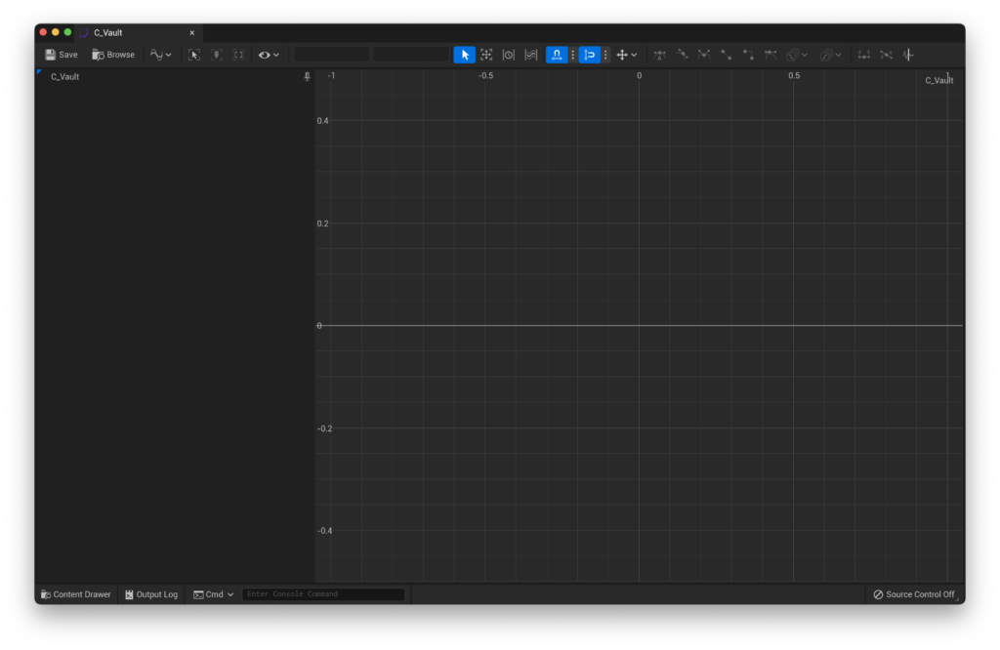

0.1.8

The most recent confirmed working version for this guide

Last time, we set up the basic movement systems of FPS Core, as well as setting up all of our inputs. Now, it's time to finish off the movement by setting up vaulting and mantling.

## Vaulting Curve

The main thing we're missing for our vaulting to work out of the box is a curve that tells our character how to actually vault over the obstacle. If we go ahead and open up FPS Character, you'll see that there's a 'Vault' category available in the Class Defaults.

If you open up 'Vault', you'll notice that it has an empty 'Vault Timeline Curve' tab. This is what we need to set up in order for our vaulting and mantling to work.

Let's hop into the content browser and create a curve. This can be found under the 'Miscellaneous' category.

When asked to select what type of curve, select 'CurveFloat'

Hit 'select' to create our curve, and name it something along the lines of `C_Vault`. When You double click it now you'll see the curve editing interface come up on screen.

Our curve essentially works as an interpolation - time graph. Essentially, when we vault, we have two unique locations. The first is the player's location before the vault, and the latter is the player's location after the vault. The curve tracks the interpolation between those two positions over time, with a value of 0 being at the start location, and a value of 1 being at the end location.

As such, we'll want our graph to go between 0 and 1 on the Y axis. The x axis is really up to you, as it determines how long the vault should take. If you want a really fast vault, you can set it to something like 0.2 or 0.3, if you want something slow and methodical, you can push 1 second. In my case, i'm going to go for something in between.

You can add keys with the middle mouse button, and i'll add one at (0 , 0) and another at (0.5 , 0), so my graph should look like this:

If you look at the highlighted portion of the image, you'll notice that we're given control over each axis value. This lets us be really precise when setting this up. I'll select the key at (0.5 , 0) and change its Y coordinate to 1.

This leaves me with a curve that looks like this (you may need to move the viewport around to see the entire curve).

We're almost done, but i'd like to add some smoothing to this curve so we don't have those sudden start/stop moments at the ends. To do this, drag-select both of the keys and in the menu bar up top, enable 'cubic interpolation'.

<figure>

<figcaption>

The cubic interpolation button is highlighted above.

</figcaption>

</figure>

That's it for our curve! Let's save, and now hop back to our character and assign that curve in the 'Vault' category. Now, it's just a matter of testing it!

You can set up a testing environment like this, and make sure that your character can vault over the lower block, but will mantle up onto the higher one :)

> If you are having issues with vaulting, but mantling is working fine, try raising your entire world up (CMD/CTRL + A, then move everything up). The mantling in FPS Core currently doesn't work below 0, as it doesn't handle negative values properly.

> If you're only able to vault once, try to re-make your vault curve (`C_Vault`). This is a rare issue that seems to be a bug with Unreal Engine's implementation of curves.

If you're having trouble with the thickness of the surface you are trying to vault, then you can adjust the amount of vault check traces that are performed within the FPS Character. Look for the parameter `Vault Trace Amount` under `Movement | Vault` and raise the value from 25 to something higher.

## Handling small gaps

Based on your game, you might encounter some issues with vaulting through small gaps, such as those shown below.

FPS Core includes a guard-rail for situations like this, which checks the height of gaps in order to check that they're large enough for the player to vault through. To adjust it, look for the `Vault Space Height` variable under the `Vault` settings in your character, which will let you fine-tune the behaviour!

If you're still having issues, don't hesitate to pop into the [support discord](https://discord.gg/MzxdZd2WqR) to get some help!

The next part of **QuickStart!** covers setting up world interaction, and can be found [here](https://emmadocs.dev/?p=74).
