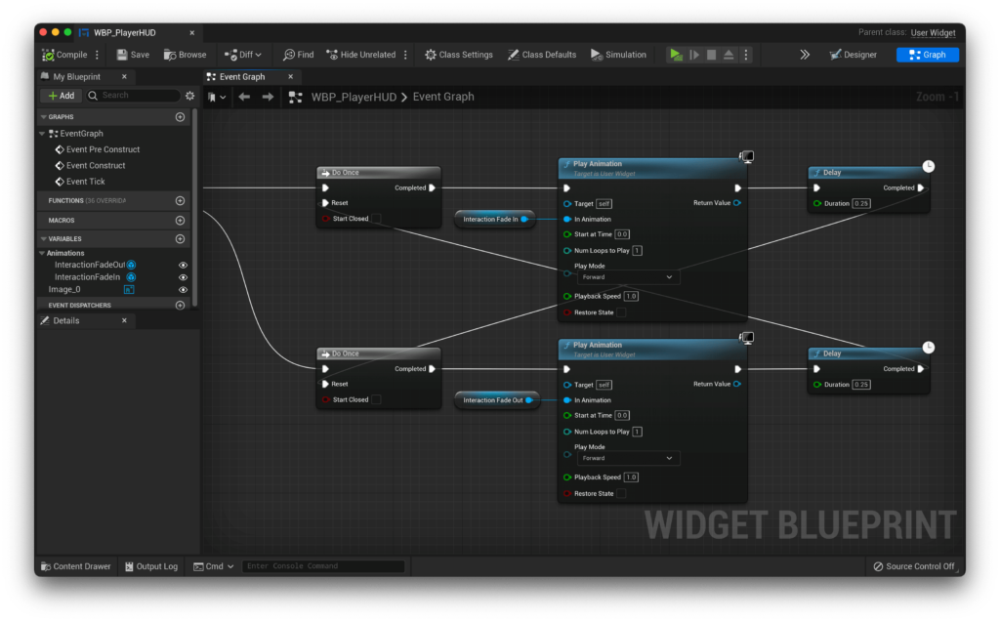

0.1.8

The most recent confirmed working version for this guide

In [QuickStart 3](https://emmadocs.dev/fps-core/quickstart-part-3-world-interaction/), we set up FPS Core's interaction system. This is a powerful system, but we left certain parts of it untapped. Namely, we have yet to take a look at the UI system that FPS Core helps you build with various useful functions exposed in the `Interaction Component`. In this small branch of the **QuickStart!** series, we'll take a look at building a compelling UI with the tools that FPS Core provides us!

## Creating the UI

Let's start by creating a widget blueprint which we will use as our HUD. Right click in a relevant folder in your content browser, and from the `User Interface` category select the `Widget Blueprint` option.

From there, make sure you select the 'User Widget' option.

We can call our widget something like WBP\_PlayerHUD, and then open it up to get started on the implementation!

If you're using UE5, you'll have to add a `Canvas Panel` to your blueprint first. If you're using any version of UE4, you'll start with a canvas panel already at the root of your widget blueprint.

On to the canvas panel, we're going to add an image object. I'm going to walk you through creating an interaction widget similar to that found in the original demonstration video from youtube.

https://www.youtube.com/watch?v=m-ztnHX7XZE

However, the principles we cover will be applicable to any sort of interaction indicator, and you're always welcome to deviate from the tutorial wherever you please.

There's an image texture i'll be using in this tutorial in order to spice up the visuals, which you can as always download here:

[Pickup Icon](https://emmadocs.dev/wp-content/uploads/2022/11/PickupIcon.zip)[Download](https://emmadocs.dev/wp-content/uploads/2022/11/PickupIcon.zip)

Let's get started by adding an image to our canvas. Just drag it in from the palette.

Let's anchor it to the centre of the screen, align it to the centre of the screen by setting the X and Y positions to 0, set the X and Y size to 50, and finally make sure the alignment is set to 0.5 in both fields. This should leave you with a perfectly centred blank image, which we can now fill in with the provided assets!

To set up the image that we want to display, let's click on the Image, and in the 'Appearance' section set the brush image to our pickup icon (or any other interaction indicator image of your choosing!).

Now that we have a giant donut in the middle of our screen, let's actually adjust the scale to something that feels 'right'. In my case, on a relatively high DPI display, I like 30 on both axes as a size, but it's really up to you :)

Now, we need to create some animations - oooooh! :D

Basically, we need two animations here. One that shows the icon, and another that hides it. If we brake it down, we basically want an animation that scales the icon from 0 to 1, and another that does the reverse.

To create an animation, we can use the 'Animations' tab you'll find at the bottom of the editor.

Opening that up, we can hit the green '+ Animation' button to create a new animation, and let's call this first one 'InteractionFadeIn'. We want this to be relatively quick, so i'm going to limit the animations to taking 0.25 seconds. In order to add our image to our animation, we'll need to hit the track button, select the relevant image, and then select the transform channel to keyframe.

By default, the X and Y scale are going to be at 1, but since this is our fade in, let's set those to 0 at our initial starting location.

Now, i'll drag the playhead to 0.25 seconds into the timeline, and set the X and Y values to 1. You should see this automatically create the relevant keyframes for you!

Perfect, now let's create the opposite animation! It's the same process, except we'll call the animation 'InteractionFadeOut' and it will go from 1 to 0, instead of 0 to 1.

Now that we have our two animations, let's set the default scale of our image to 0 in the `Render Transform | Transform` panel.

## Code Implementation

Now that we have our animations, let's implement them in code!

Let's start by hopping over to the Graph workspace.

In here, we're going to do the unholy and use `Event Tick`. In general, using `Event Tick` is not the best practice, but as the performance impact of what we're doing is not large, it won't cause us any performance issues.

Our first step when dragging off `Event Tick` is to cast to our FPS Character. When asked for an object, we can pass in `Get Player Pawn`. From here, let's get our Interaction Component with the `GetComponentByClass` node, check for it's validity, and if it's valid, output to a branch based on the `CanInteract` condition from our Interaction Component. Complex? No worries - the screenshot below shows the final result :)

Let's deal with our `True` logic first. If we can interact with a given object, let's play our `InteractionFadeIn` animation using the `Play Animation` function, with `InteractionFadeIn` as an input. Let's also make a `Do Once` node, and put that between our `True` result and our `Play Animation` node. You should end up with something like this!

Now, let's do the False output. It's almost identical, spare for the animation it plays being `InteractionFadeOut`.

Now, let's resolve what these `DoOnce` statements are for. After each `Play Animation` node, we're going to add a `Delay` set to 0.25 seconds (or whatever the length of your animation is), then drag that into the opposite output `DoOnce`. This might be a little confusing, so use the screenshot below to guide you.

That's it for our interaction indicator! The full blueprint is below if you'd like to see it:

<iframe src="https://blueprintue.com/render/vhlt23cl/" scrolling="no" allowfullscreen style="width: 100%; height: 500px;"></iframe>

## Applying to our character

Let's actually apply this to our character now! Inside our character blueprint, on the `BeginPlay` event, we can execute the `Create Widget` function to create our widget blueprint (which is specified in the class), and then add the return value to the viewport.

## Displaying names

If you've followed along with some other parts of the **QuickStart!** series, you may remember how we have 'named' some objects, like ammo and weapon pickups. It's finally time to show you how to implement these into your projects, let's take a look!

To start, let's add some text to our HUD widget blueprint, and much like our interaction icon, anchor it to the centre, but this time, let's keep it floating slightly over top of your icon (you may want to temporarily set it's scale back to 1 in order to see it). I ended up with a Y position of -45, and i've raised the X size to 400 and centred the text, which leaves me with a result like this:

It's time to animate our text! It's very much the same type of animation as our little interaction indicator, but this time, instead of animating the scale, we're going to animate the Opacity. You might have to give your text a name for it to show up in the animate menu, so i'll call mine `Interaction Text`, and now i can see it in the 'All Named Widgets\` section of the Track button.

I'll add it, then choose to animate the `Render Opacity`. I'm starting with the fade in, so this will start at 0, and animate towards 1. That should look like this:

Naturally, we'll also have to do the opposite, so for `InteractionFadeOut` we'll repeat the steps above, but starting with a render opacity of 1 and ending with 0.

Finally, let's add our functionality. Let's create a function binding for this text.

We'll start within our binding by getting the 0th element from a `GetAllActorsOfClass` call, from which we can then obtain a reference to our `Interaction Component`. From here, we can check it's validity, and if it _is_ valid, we can use the `GetInteractionText` function to get the text we're looking for!

<iframe src="https://blueprintue.com/render/4a9h49-j/" scrolling="no" allowfullscreen style="width: 100%; height: 500px;"></iframe>

Remember to return empty text if the Interaction Component is not valid!

With that done, you should now be able to walk up to any pickups that have a name set, and it should show up on your UI above the pickup indicator, which should always indicate an interactable object!
