0.1.8

The most recent confirmed working version for this guide

Now that we have a fully functioning character, it's time to start building up the systems of interaction around that so that we can start interacting with the world. For this, FPS Core provides `InteractionActor` and `InteractedActor`. These are designed as a very flexible framework to create interactions, and are scripted in Blueprint.

## Enabling Interaction in the Character

But, before we can get started, we need to make sure that our player supports interaction with these components. This is handled with the built in actor component `Interaction`. To add this, open up `BP_FPSCharacter`, and in the Components tab press the + key:

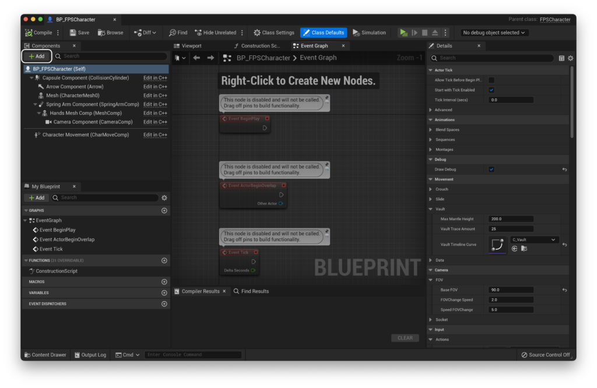

From here, add the `Interaction` Component:

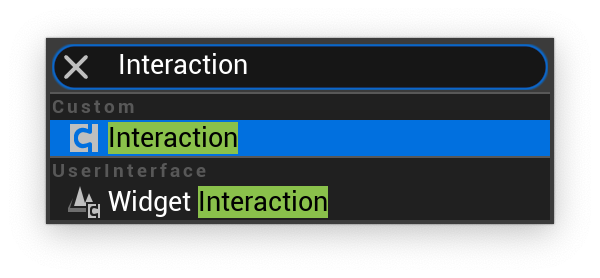

`Interaction` might not appear to do anything at first, but this is the component that handles interacting with the aforementioned `InteractionActor`. It draws a line trace from the center of the camera and triggers an input in hit actors that implement the interface. But you don't need to understand any of that to make the most of the interaction system included with FPS Core.

## Creating interactable actors

Now that our player implements the `Interaction` Component, we need to create something to interact with. To do this, we're going to create a blueprint that derives from `InteractionActor`.

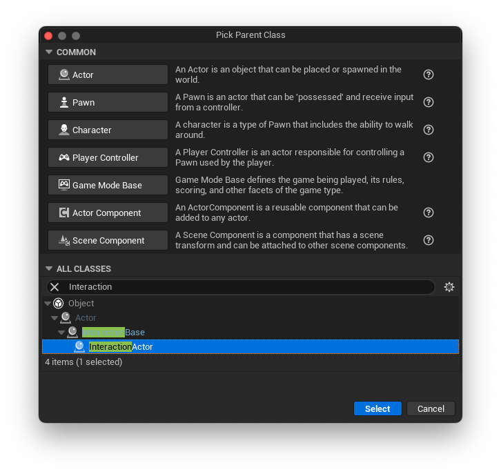

I'm going to name mine `BP_Button`, and place it into a folder called `Interactables`.

Opening up `BP_Button`, you'll notice that there is already a mesh created, and that we have an array of 'Interacted Actors'. When a child of `InteractionActor` is interacted with, it will delegate that interaction call to any number of `InteractedActor`s, allowing you to build complex logic from a very simple, robust core. It also includes a general name system, so `InteractionActor`s always have an associated name that we can reference in UI.

Let's set up our button first! If you'd like to follow along exactly, you can grab the button I've created from the link below:

Button model & textures

If you set the materials up and drag it into the engine, you should see this:

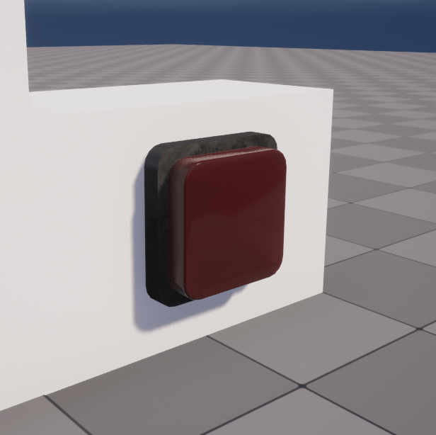

Now, we can make our way back to `BP_Button`, and assign this as our Mesh, which should leave you with a lovely button!

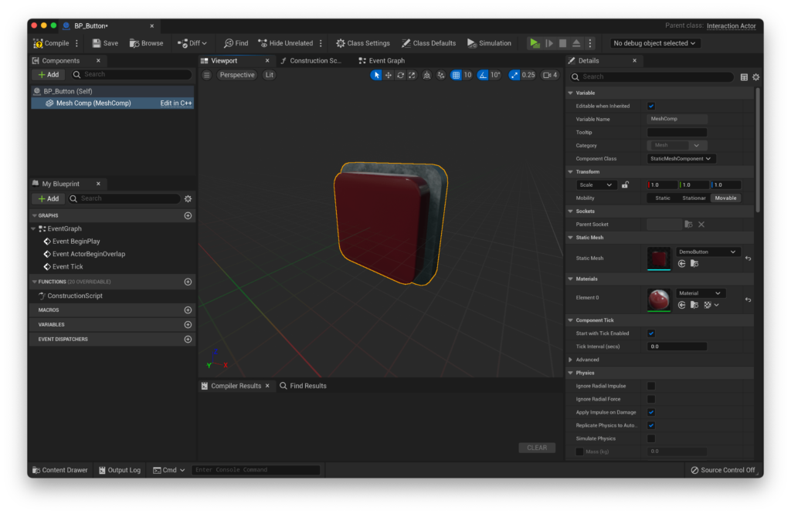

We can now bring `BP_Button` into our scene!

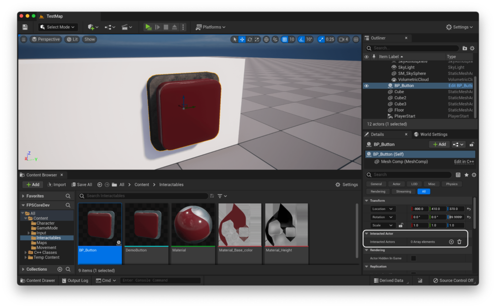

You'll notice in the editor that there's an editable array called `Interacted Actors`. This is the main way that you are able to interact with actors in FPS Core. However, let's explore this functionality further.

## Interacting with something

There are two main ways that we can handle interactions in FPS Core.

The first is with the `Interacted Actors` array that was described above. If you actually tried to select something to interact with, you'll have found out that you... can't. That's because this only works with a special class of actor - any subclass of `InteractedActor`

Let's create an `InteractedActor` now.

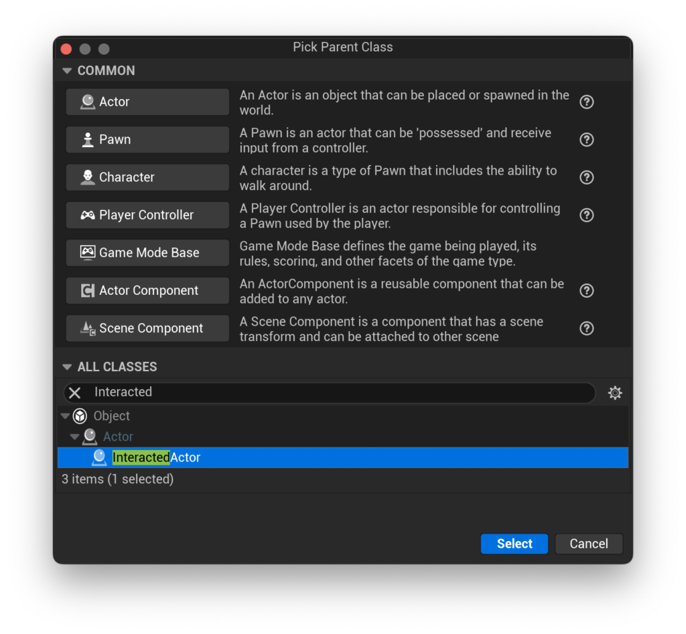

A good demonstration of how this works is a lightbulb/switch, so let's create a lightbulb here. I'm going to call this actor `BP_InteractedLight`.

If you open `BP_InteractedLight`, you'll notice that it looks very similar to a default `Actor` class. I'm going to add a simple point light to my actor, and then move over to the Event Graph.

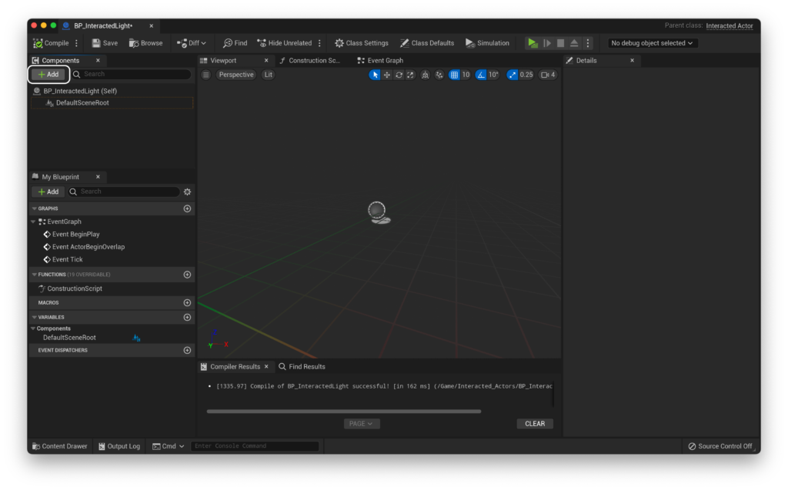

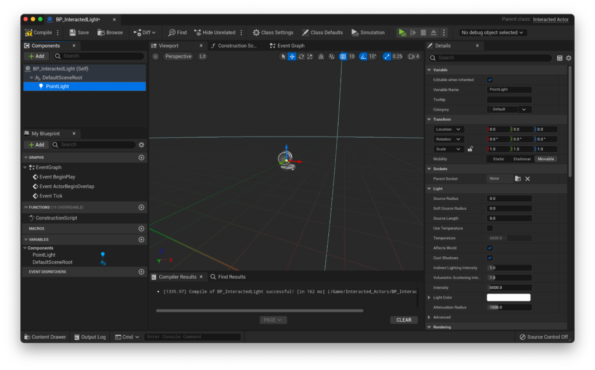

Here, you'll find the `On Interacted` function.

This function is called every time an `InteractionActor` that references the current `InteractedActor` is interacted with.

That might be a little confusing, so let's put this into practice.

Let's start by disabling the visibility of our light. We can do this in the details panel for our `point light` component.

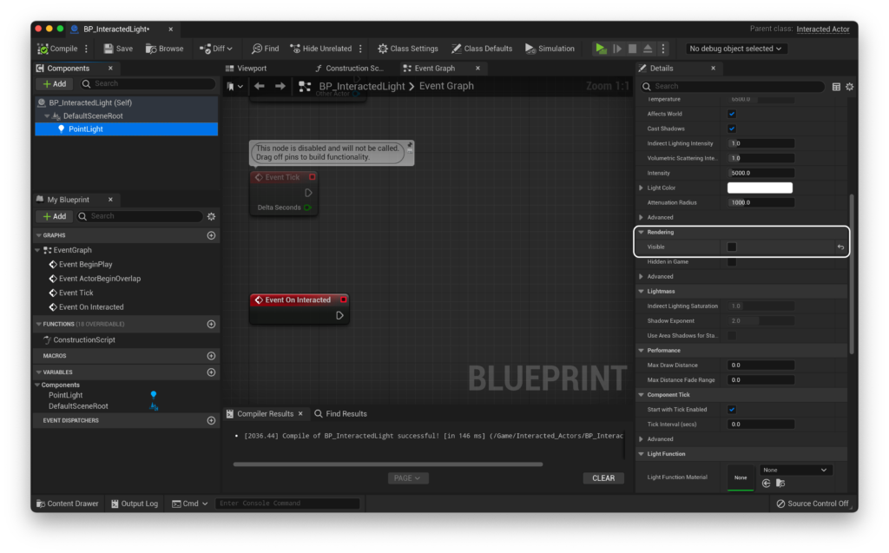

The next step is to set up our logic. I'm going to use a flip-flop node in order to swap the visibility of the light each time it is interacted with. I can then hook that up to a `Set Visibility` node in order to dynamically adjust the visibility of the light.

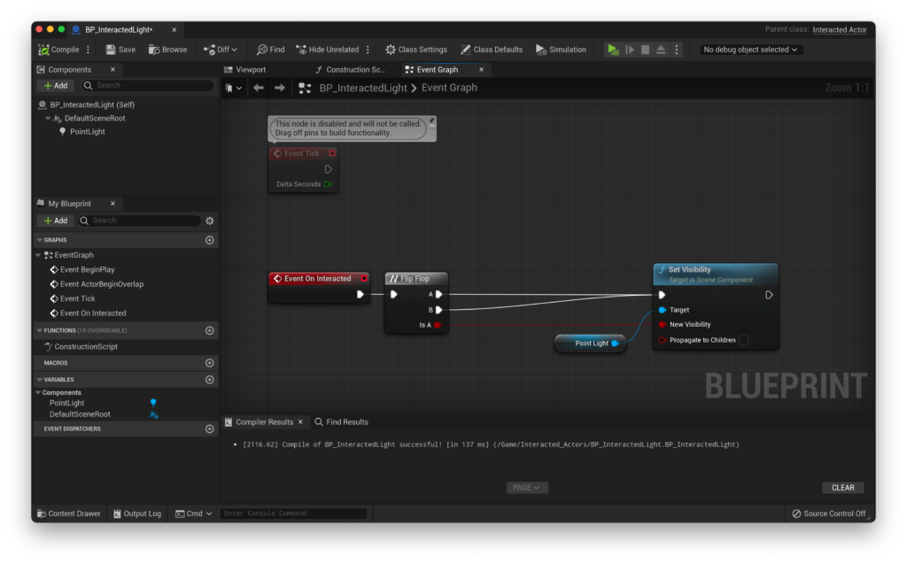

With that set up, we can now return to our level and add the light to our scene. Then, we just need to add the light to our `Interacted Actors` array in our button! Create an entry, and then you can either use the eyedropper tool to select it from the viewport or use the drop down to select it from the inspector. Neither of these will let you select actors that don't derive from `InteractedActor`.

If you're struggling here, make sure that you're trying to add entries from the details panel in the editor view with your button selected, like below:

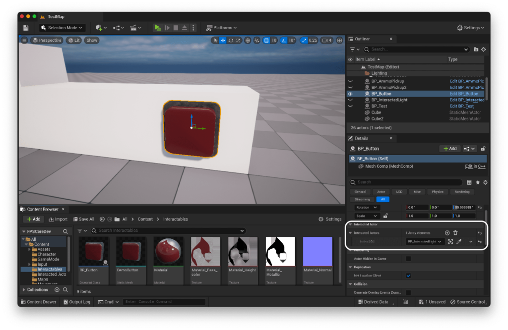

You should end up with something that looks like this.

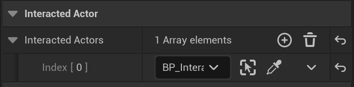

If you run the game now, you should be able to look directly at the button from relatively close up, and use the 'interact' key that we set up in [QuickStart! Part 1](https://emmadocs.dev/?p=25) to interact with the button, and you should see the light turn on and off!

You can naturally link up as many lights as you want, and not just lights but also any other actors that implement a wide variety of logic, as long as they derive from `InteractedActor`

It is also possible to run logic inside of an `InteractionActor`, such as our button.

These actors include two blueprint implementable functions - `On Interaction` and `Interaction completed`

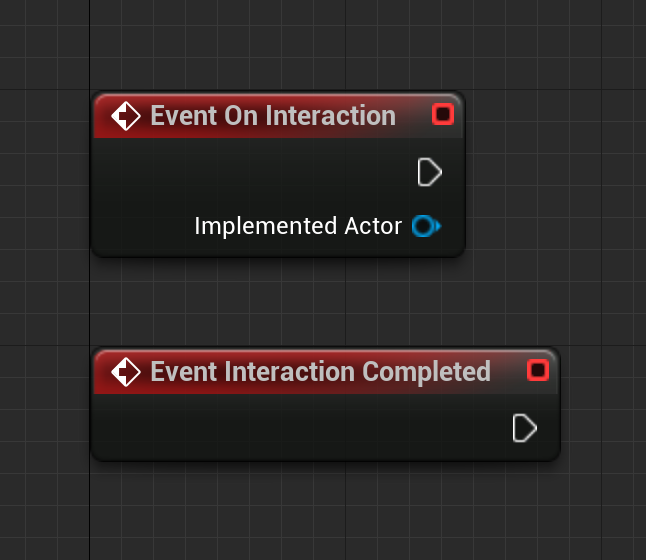

`Interaction Completed` is relatively self explanatory, as it is called after all the connected actors have been 'interacted with'. If you wish to run logic on just an individual interaction actor (such as a button that plays a sound when it is pressed, for example), you can implement that logic in the `Interaction Completed` event. There's no need to created `Interacted Actor`s if you're just planning to delegate to one output in the location/blueprint as your input.

`On Interaction` is called for each actor that's referenced in the `Interacted Actors` array after their interaction has been run. It also includes a reference to that actor, so that you can perform additional logic there if need be, such as deleting an actor that has run some required logic, updating variables within those actors, or performing bulk operations with data from the `Interaction Actor`.

There you go! That's all the basics of the FPS Core interaction system! If you're having trouble with any of the steps and want to learn more, you're always welcome in the [support discord](https://discord.gg/MzxdZd2WqR) :)

The next part of **QuickStart!** covers setting up weapons, and can be found [here](https://emmadocs.dev/fps-core/quickstart-part-4-adding-weapons-and-animations/). If you'd like to learn how to integrate interaction into your UI with features like custom names and an interaction indicator, you can check out the UI expansion on this page [here](https://emmadocs.dev/fps-core/quickstart-part-3-1-interaction-ui/).
