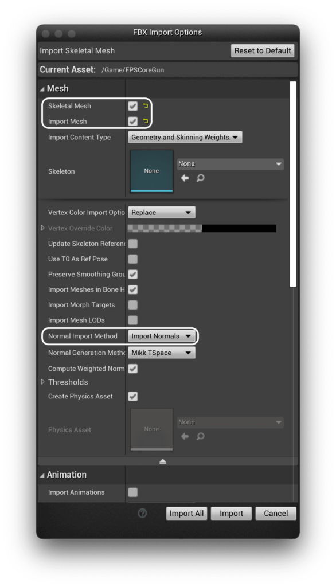
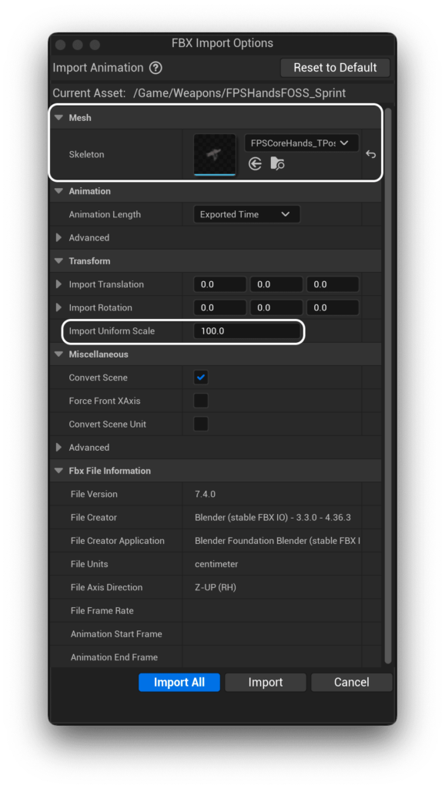
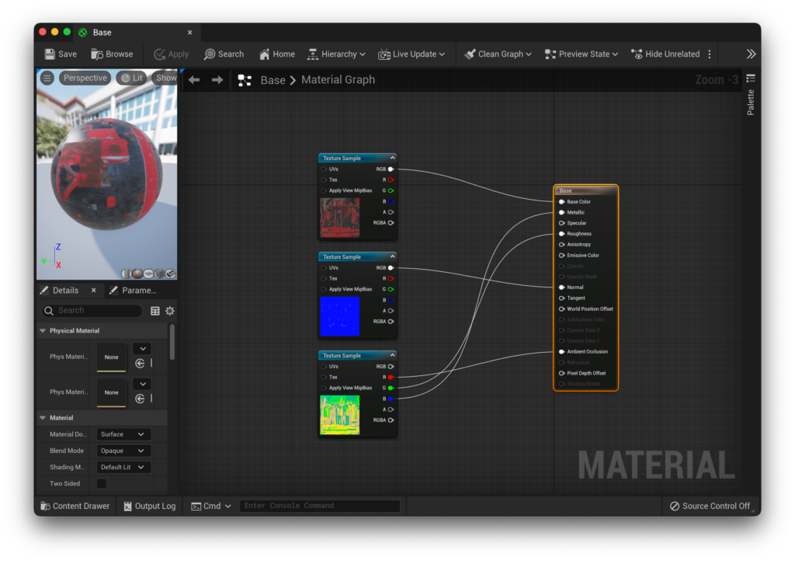
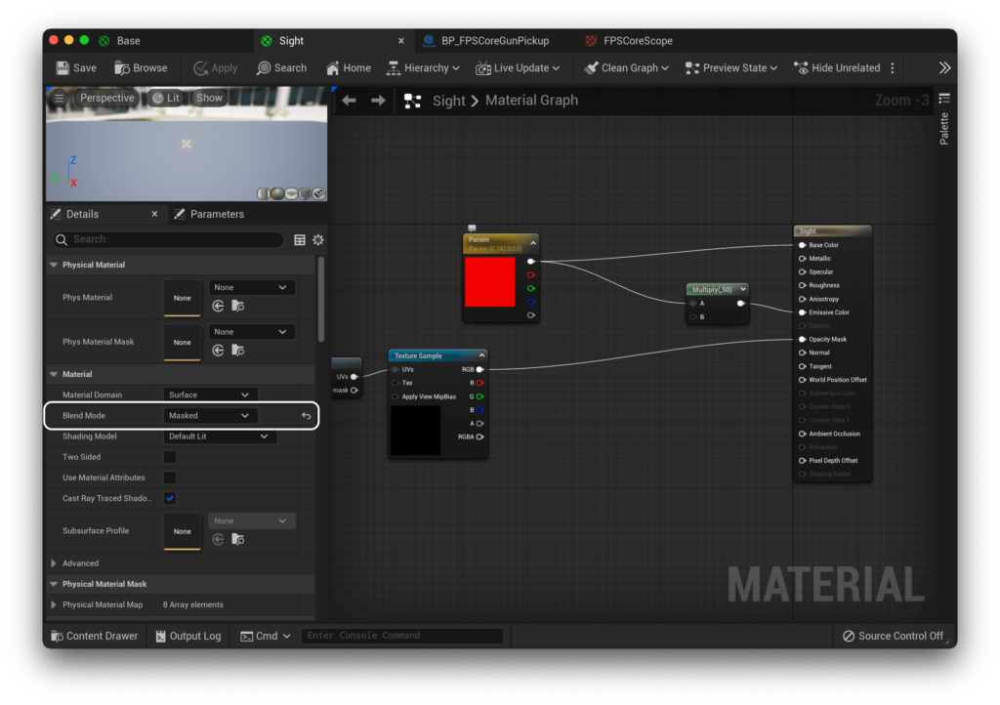
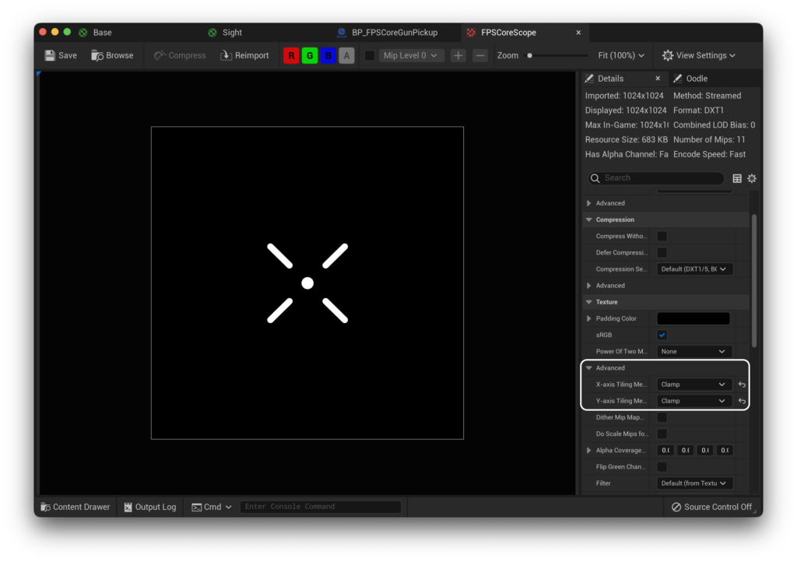

0.1.8

The most recent confirmed working version for this guide

If you haven't got your own set of animations and weapons to use with FPS Core, this tutorial will provide you a set of weapons that fulfil all the necessary animation states required for FPS Core, as well as a set of files so that you can create your own animations, should you choose.

You can download the first set of animations, as well as the weapon model below!

[FPS Core Animation Pack](https://emmadocs.dev/wp-content/uploads/2022/09/FPS-Core-Animation-Pack.zip)[Download](https://emmadocs.dev/wp-content/uploads/2022/09/FPS-Core-Animation-Pack.zip)

This folder is broken down into three 'sets' of content. Firstly, you have the meshes, found in the `Models` folder. These should be imported separately, and first. Make sure that their skeleton slot is empty, so that they import their own skeleton.

It is also worth changing `Normal Import Method` to `Import Normals`, since i've authored normals for these weapons in Blender and you risk unreal generating improper normals if you go with the default option.

The next folder is the `Animations`! First, make sure that your skeleton is set to `FPSCoreHands_TPose`. Next, set the `Import Uniform Scale` to 100. There's an unfortunate bug here with blender and Unreal Engine that necessitates us importing animations with a scale of 100.

<figure>

<figcaption>

No, I don't know why my hands mesh shows up looking like the weapon either.

</figcaption>

</figure>

Once you've imported your animations, it's time to turn our attention to the final folder, `Textures`. Inside `Textures` you'll find two sets of textures - a full set of textures for the weapon, and `FPSCoreScope.png`, which, as the name suggest, we'll use for the scope!

Let's deal with the weapon's texture set first. When you imported the weapon for the first time, you'll notice that it created two different materials for you - `Base` and `Sight`.

Base covers the entirety of the model, and sight covers, well, the sight. Let's look at the base first.

Let's open up the base material, and delete the white color that's being used as a base color. Then, let's align our 3 textures to their correct slots. Base will go to Base Color and Normal will go to Normal. For the OcclusionRoughnessMetallic map, we'll have to deal with it slightly differently. The R channel will go to the Ambient Occlusion channel, G to Roughness, and B to Metallic.

If you save that, you should see that your weapon is now a pleasant shade of red!

Let's deal with the sights next. This is a slightly more complex node setup. We're going to use the `ScreenPosition` node along with some more node magic. I won't elaborate on what this does here now, but TL;DR, it centres our crosshair in screen space.

> Correction
> 
> You'll notice two ConstantBiasScale nodes in the above image. Their values are as follows:  
>   
> First Node (coming from ScreenPosition): Bias: -0.5, Scale: 2.0  
>   
> Second Node (coming from Multiply): Bias: 1.0, Scale: 0.5

It's also important that we get the type of material right. We want most of the sight to be completely clear, with only the crosshair visible. For this, we need to set our Blend Mode to `Masked`.

and then hook up the provided texture to the `Opacity Mask` output. This lets us then pass any color into the base color, and have that show up as our scope! We'll also multiply this output by a large number (in my case 50), and plug that into the emissive channel to get that lovely glowing effect.

<iframe src="https://blueprintue.com/render/j_wwztqs/" scrolling="no" allowfullscreen style="width: 100%; height: 500px;"></iframe>

There's one last thing we have to do before we're ready to hit play and get going, and that's disable tiling on our scope texture! By default, all unreal textures tile, which is generally what you want, but in this case it just means that we'll see duplicate sights at certain angles, which is not what we want. We can disable this by opening up the texture, and changing the X and Y-axis tiling methods to `Clamp`

With that done, you should have a beautifully set up weapon that has a functioning sight!
