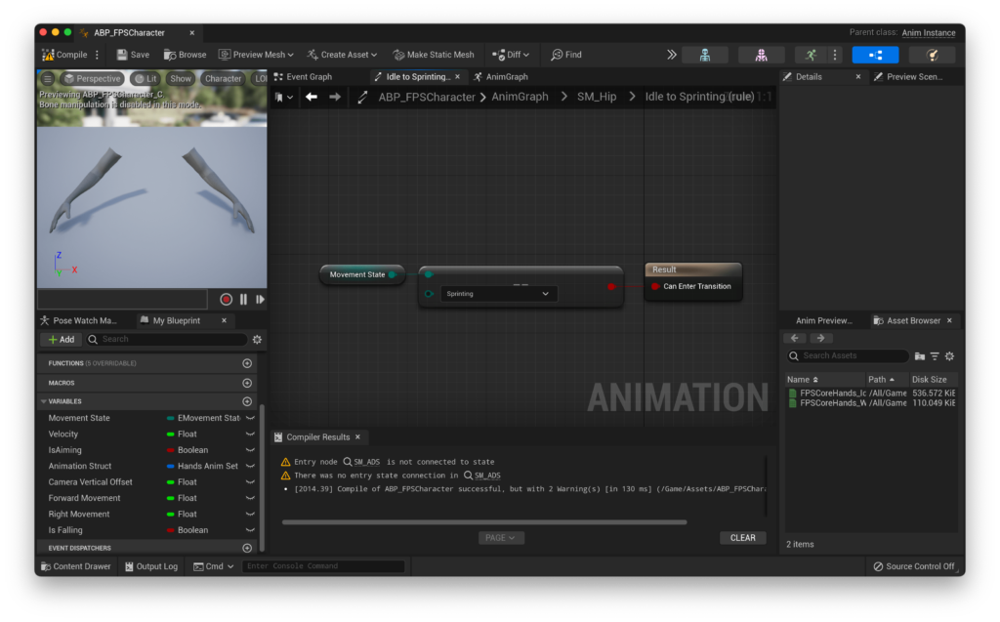
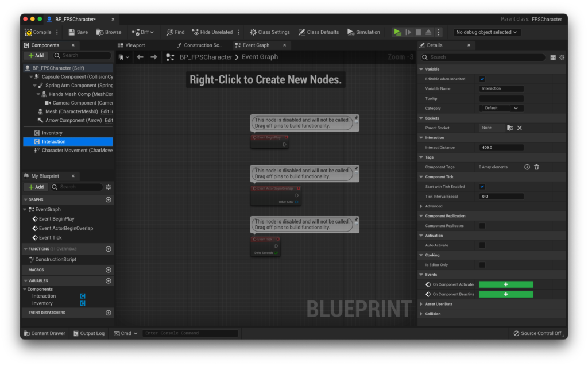

0.1.8

The most recent confirmed working version for this guide

So far, we've talked about the **FP** part of FPS Core, focusing on movement and interaction. Now it's time to fulfil that final **S**, and set up weapons and animations.

If you'd like to support FPS Core and get a high-quality set of animations to use with this tutorial, FPS Core and beyond, please consider checking out the [SMG-30](https://www.unrealengine.com/marketplace/en-US/product/smg-30-fps-weapon-pack) on the Unreal Engine Marketplace!

Alternatively, you can use a free mesh and animation set, or you are more than welcome to use your own. If you'd like to download the free FPS Core sample and learn how to set it up, [please follow the guide here](https://emmadocs.dev/fps-core/quickstart-part-4-1-setting-up-the-included-weapon-and-animations/). With that said, let's get started!

## Setting up the character

The first thing to do is actually set up the character mesh.

To start, let's add it to our hands skeletal mesh (FPSCoreHands\_TPose) to our character. Open up `BP_FPSCharacter` and set the `Hands Mesh Comp` to a set of FPS Hands, either the ones provided above or an equivalent :).

Make sure that these are rotated correctly (in the forward direction denoted by the blue arrow), and that their origin is roughly centered on \[0,0,0\]. For me using the mesh download that's available above, i've moved the mesh down by 155 units (so a final location of \[0,0,-155\]), and added a rotation of -90 on Z (so a final rotation of \[0,0,-90\]).

You might notice though that our camera isn't attaching to our skeleton. Often, you will want the camera to be attached to it's own socket in the skeleton so that you can animate it independently.

Due to the way that Unreal handles assigning sockets to attached components that derive from `USceneComponent`, it's unfortunately not possible to let you choose the name of the socket which the camera can attach to. Rather, it must be set by default in the object's initialiser function. In FPS Core, this default value is "CameraSocket". As such, we need to now create this socket within our hands mesh.

Open up the hands mesh skeleton (FPSCoreHands\_TPose) and find the bone called 'Camera' in the bone hierarchy. Right click, and select 'add socket'

In my case, because my bone is called 'Camera', the created socket is automatically going to be called 'CameraSocket', but if yours is named differently, take this moment to rename it to `CameraSocket` by double clicking on its name. We don't need to change any other settings here, so go ahead and save, then close the skeletal mesh.

If you play the game now, you might notice that the camera is in a really strange spot and it's a bit nauseating to play and control, if it's even possible. This is because the camera retains its offset and rotations, which are no longer accurate as it's now centered on the camera socket, not the origin.

You will probably have to go into `BP_FPSCharacter` and reset the location to \[0,0,0\], and update the rotation so that the camera faces forward. You'll likely also find that you need to adjust the scale of the camera so that it doesn't take up your whole screen :p

You may also want to adjust the default FOV here. The assets that I have provided were animated with an FOV of 77 degrees, so if you want them to feel right, and not clip the camera, it's advised to update the base FOV in the Class Defaults to 77.

In the future, I will cover setting up panini projection in order to allow for free FOV adjustment without distorting the mesh a huge amount, for now you can read up on this in the [Unreal Engine Documentation](https://docs.unrealengine.com/4.27/en-US/RenderingAndGraphics/PostProcessEffects/PaniniProjection/).

## Creating the Animation Blueprint

Now that we have our mesh set up, it's time to give it some life with an animation blueprint!

I'll go ahead and create one and call it `ABP_FPSCharacter`. When prompted, select the skeleton of the skeletal mesh that you are using in your character. In my case, I only have one.

Opening up our Animation Blueprint, we'll need to set up a number of variables that come packaged with FPS Core in order to get our animations working how we'd like.

Let's hop over to the event graph and drag out of `Try Get Pawn Owner` to a `Cast to BP_FPSCharacter` (or whatever your character class is called) node.

## Observing State

Now, we can begin to get a reference to the variables that we will need. Ideally, we'd like to know whether our character is sprinting, crouching, aiming down sights, and other such state changes. If you remember in [QuickStart! Part 1](https://emmadocs.dev/?p=25), when we set up movement, we made use of a Movement State enumerator in the character. This exact value is actually exposed to blueprints! We can drag out of our character cast node and find the `Get Movement State` node, then promote that to a variable.

We also want to know what speed our player is moving at - this will help us transition between animations smoothly, and prevent cases like our character playing the sprinting animation when the player is holding the sprint key, but not actually moving. In this case, the movement state will be `Sprin`t, but we want to still be playing the idle animation. So, let's drag out of our character reference again and this time find the `Get Velocity` node. From there, we can call `VectorLength` to turn our vector into a scalar and output that to a variable called `Velocity`. You should end up with something like this.

Next, we need to keep track of whether or not the player is aiming down sights. As you might be able to guess by now, this is another of the variables that FPS Core exposes to blueprints. We can use the `Is Player Aiming` function to retrieve this value, and store it in an appropriately named variable.

We also want to be able to get the direction that the player is moving. This can come in useful for procedural weapon sway, but for now we're just going to use it to power some animation blend spaces. For this, we're going to use the built-in functions `Get Forward Movement` and `Get Right Movement`. We can promote both of those to their own variables, that i'm going to call `Forward Movement` and `Right Movement`.

Finally, we want to know if our character is in the air for use with our jump animations. To do this, we can use unreal's built in `Is Falling` function, which can be called from the character movement component. As usual, i'll just promote this to a variable of the same name.

Now, we need to actually set up our animations! Rather than doing this statically, let's use FPS Core's built in dynamic animation system.

The way this works is by embedding animation data into the weapon class. This way, we can _drastically_ simplify our animation graph, and have it work for a theoretically unlimited amount of weapons with no additional work (at least in the anim graph :p). Not only does each weapon have its own set of variables, but the character also contains a set of animations for situations in which the player does not have a weapon equipped.

Before we access them however, we need to actually figure out whether the player is holding a weapon or not. To handle this, FPS Core comes with the `Inventory Component`. We'll discuss what `Inventory Component` does in more detail in a little bit, but for now, just know that it contains the reference to the player's current weapon. Before we check the validity of the weapon, let's also check to see if we actually have a valid `Inventory Component`. Most of the time you will, but it'll save you a crash if you forget to add it or something, and it's just good practice! We can run a `Get Component By Class` node, selecting `Inventory Component` as our component class, and then running that through an `Is Valid` node (make sure to use the one who's icon is a question mark!). We can then drag out of `Get Component By Class`, and find the `Get Current Weapon` node, again passing it through an `Is Valid` check! All together, that should look like this:

Now, if either of these returns false (we don't have an `Interaction Component` or a `Current Weapon`), we want to default to the animations stored in the player character. To do this, we can use the function `Get Player Animations`, which returns a struct that contains all of the animations that we will need. We can then make a local variable and keep that updated based on the status here.

Let's get started then! Pull out a `Get Player Animations`, and promote its return value to a variable. Then, we can hook up both `Is Not Valid` return pins to our variable set. We can then pull `Get Weapon Animations` out of `Get Current Weapo`n, and connect that up to the `Is Valid` return.

<figure>

<figcaption>

You should end up with this funky looking setup!

</figcaption>

</figure>

There's one more variable that we need to be able to keep track of, and that's the vertical camera offset. This is a way for us to adjust the vertical position of weapons during ADS, so that you can have sight attachments of various heights. It's very much the same process here as before. We're updating a variable (which I will call `Camera Vertical Offset` with a getter function from our `Get Current Weapo`n. This time, we can use `Get Vertical Camera Offset` to get this value, and update that when `CurrentWeapon` is valid. When it's not valid, we can just set `Camera Vertical Offset` to 0 :)

If you'd like to see the full graph we just made, as well as have the ability to copy it, you can do so through the interactive Blueprint window below.

<iframe src="https://blueprintue.com/render/26e455p-/" scrolling="no" allowfullscreen style="width: 100%; height: 500px;"></iframe>

## Creating our animation graph

Let's look into actually implementing our animations now! We're naturally going to do this in the Animation Graph. The first thing we need to do here is actually to add `Slot 'DefaultSlot'`.

This allows us to play animation montages, over our base animations. Now that that's done, let's add a `Blend Poses by Bool` node, and hook up `Is Aiming` to the `Active Value` pin. You can set the `True Blend Time` and `False Blend Time` values to whatever you like, but for me I have mine set to 0.3 and 0.4 respectively. You can also adjust the type of interpolation in the details panel of the `Blend Poses By Bool` node. By default, it's set to `linear`, but I prefer `Cubic In Out` as it gives aiming a slightly snappier feel.

Now, let's start creating out state machines! We will need two of them, one for our 'hip' position, and the other for when we're aiming down sights. For now, let's start with the hip position by adding a new state machine coming off of the 'false' pin of our `Blend Poses By Bool` node, and call it something like `SM_Hip`. Before we head in and set up our state machine, let's finish our animation graph. For this, we're going to need one more state machine, which i'll call `SM_ADS`, and a `Transform (Modify) Bone` node. In `Transform (Modify) Bone`, you can disable the rotation and scale pins, set the `Bone to Modify` parameter to `Camera` (or your skeleton's equivalent), and make sure that the `Translation Mode` is set to `Add to Existing`. Then, you can set `Translation Z` to our `Camera Vertical Offset` variable, and plug `SM_ADS` into the `Component Pose`, then that small chunk into the `True Pose` pin on our `Blend Poses by Bool` node.

> Be aware that copy-pasting the below blueprint nodes seems to crash the editor - make sure you're saved before attempting!

<iframe src="https://blueprintue.com/render/0i99-099/" scrolling="no" allowfullscreen style="width: 100%; height: 500px;"></iframe>

## Setting up our State Machines

Now, it's time to actually build our state machines!

### SM\_Hip

Let's start with SM\_Hip. We're going to need 3 states to start off - Idle, Walking and Sprinting. Then, let's connect all of them, and connect Idle to the entry.

Let's add our idle animation first. Inside our idle state, add a `Sequence Player` node and connect it to the output pose.

> If you are using Unreal Engine 4, you won't see the option to add a Sequence Player node.
> 
> You will have to add an animation, and set the 'Sequence' node in the details panel to 'Exposed as Pin'. That will let you connect a variable to it. From there, you can copy-paste this node where it's needed, or simply repeat the process.

If you compile after adding it, you'll get a very unfriendly looking `ERROR!` underneath it. This is because sequence player's by default do not have an animation within them. We don't want to assign an animation though, we want to be able to control this with a variable. Thankfully, this is totally possible! In the details panel, you'll find the `Sequence` value, which likely will say `Bind`.

If you click on `Bind`, you'll notice the `Expose as Pin` option. If we select that, you'll notice we now have a variable input! That means that now, we can bring in our `Animation Struct`, right click on the pin and click `Split Struct Pin`, then connect `Animation Struct Anim Idle` to the `Sequence` Input! Perfect, now we have an animation bound to a variable that we can change dynamically based on what weapon the player is holding (and if they are holding one at all!).

Let's set up the rest of our animations before programming our connections. For the `Sprinting` state, this is fairly straightforward - it's the exact same setup as in the `Idle` state, but with the `Anim Sprint` output.

In the case of the walking state, we are using a Blend Space. Fortunately, this is quite a simple switch. Instead of a `Sequence Player`, we can use a `BlendSpace Player` instead! Here we also need to expose the `Blend Space` pin in the same way as we did above.

Now, we can hook up our blend space from our `Animation Struct`, as well as plugging in our `Right Movement` value into X and our `Forward Movement` value into Y.

There we go, that's our set of animations added to unreal. Now, we need to actually handle the transitions between them. Let's handle Idle to Walking first. Here, we can use our previously created `Velocity` variable, and simply check that it is greater than 0!.

To handle our return (Walking to Idle) transition, we need to do _almost_ the same thing, but not quite. Instead of simply checking if the character's velocity is equal to 0, let's instead use the `Is Nearly Equal` node to check whether we're close to 0. We can set the tolerance to something like 0.5, which will mean that if the character is moving ever so slightly, they won't play the walking animation!.

Next, let's deal with our Walking to Sprinting transition. Here, we already know we are moving, so we can just check our movement state enum with an equals node to see if it is equal to Sprinting. That'll do the trick!

For the inverse (Sprinting to Walking), we need a little more logic. We want to check if we're moving (if not, we will transition directly to idle), and then whether we are not in the sprinting state. Together, these should give us an accurate indication of when we are no longer sprinting.

Finally, let's handle our Idle to Sprinting transition. This looks similar to our Walking to Sprinting, but like sprinting to walking we also need a velocity check here. However, this time we need to check whether the velocity is above 0.

> Correction
> 
> The below image represents the incorrect transition. You will need an AND gate to check whether the player is in the sprinting state and their movement speed is greater than 0.

The reverse (Sprinting to Idle) looks very similar to our Sprinting to Walking, but instead of checking that we have a velocity greater than 0, we check that our velocity is very close to 0, essentially combining our Sprinting to Walking and Walking to Idle transitions into one.

### SM\_ADS

SM\_ADS is even simpler than SM\_Hip, at least in the configuration that's been set up in [QuickStart! Part 1](https://emmadocs.dev/?p=25). There, I gave an example Movement Data Map that does not allow aiming down sights while sprinting. If you've decided to allow players to ADS while sprinting, the way we're setting up the AnimGraph here means that the walking ADS animation will play when sprinting while aiming down sights.

If you'd like to have a custom animation for this, just don't remove the sprinting state in the next step. You'll also have to source animations for it, as well as add a new variable to the `FHandsAnimSet` struct in `WeaponBase.h`. If you're trying to do this and struggling, don't hesitate to use the [support discord](https://discord.gg/MzxdZd2WqR) to get help.

Let's copy our entire graph from SM\_Hip to SM\_ADS. Then, if you're not aiming to have aiming available while sprinting, we can remove the sprinting state from our state machine.

Now, we can go in and adjust the animations that these states play back. For our Idle state, we can update our animation to `Anim Ads Idle`.

And for our Walking state, we can update to `BS Ads Walk`.

Nice! That's our basic animation setup done. If you'd like to add jumping animations, that's something you can learn about here \[Coming Soon!\].

## Adding a weapon

With our animation setup done for the moment, let's turn our attention to actually creating a weapon.

In FPS Core, weapons consist of two parts, the weapon asset itself, and a weapon pickup. Weapons also draw all their data from a Data Table, which gives you a central place to organise all the weapon data you need. Let's start with the weapon asset itself.

Let's start off by creating a new weapon blueprint. This one will derive from `WeaponBase`, and in my case, i'm going to call it `BP_FPSCoreGun`. If you're using the provided weapon from above, i'd recommend this naming scheme too - if you're using something custom, you're probably better off going with something more representative of the asset you're actually using.

Before we enter into our weapon, let's first set up our data structure for it. Most of the weapon's data will flow through a data table. This allows us to more efficiently organise data in a readable way, and especially once you begin to have more weapons in your project this way makes a lot more sense than having to go to individual actors to adjust balance statistics and variables.

To do this, let's create a data table from the `Miscellaneous` menu. When prompted which type of row structure to use, select `StaticWeaponData`.

I like to call this asset `DT_WeaponData`. Let's add a row in `DT_WeaponData` for our FPSCoreGun. To do this, simply hit the 'Add' button in the menu.

This will give you an empty row full of weapon variables. First though, we need to give it a name. This is a case-sensitive string value which uniquely identifies a weapon in the data table. To edit it, simply double click where it says 'NewRow'. We'll need this later in order to link our weapon class to the data table, so maybe copy it to your clipboard once setting it. I called mine `FPSCoreGun`.

Before we set all of the variables that the data table exposes, let's first turn our attention back to our `BP_FPSCoreGun`. Here, we need to set a few variables before proceeding. One of those variables is a weapon pickup reference. This tells the weapon what to spawn when it is replaced by another weapon. Let's create one now!

## Creating a weapon pickup

Weapon pickups should derive from the `WeaponPickup` class, which sets us up nicely for any sort of weapon pickups.

I like to call mine the same thing as my weapon, but with a `Pickup` suffix. In this case, that would be `BP_FPSCoreGunPickup`. If you look inside we have a few values to fill up before we move on.

The first is a reference to our weapon, which should be set to `BP_FPSCoreGun` (or your equivalent, if you're using a custom weapon). The second should be the Data table that we just created. Finally, for the highlighted mesh, we can set this through the visual editor - but first we need a static mesh!

If you're using the assets i've provided you with, you'll only have a skeletal mesh of our weapon. Fear not, for unreal gives us a lovely way of converting to a static mesh in-engine! Simply open the skeleton of our mesh, and hit the 'Make Static Mesh' button! Then, just save it to a convenient location.

Now, we can head back to our pickup, open the full blueprint editor, and then set our Mesh Comp to be our newly created static mesh!.

Now, we can head back to our data table and start filling things in. The first thing to do is to uncheck 'Has Attachments' in the `Attachments` category. This weapon does not feature attachments, and so has no use for this feature. Then, we can start filling in values from the top. Our pickup reference should be our `BP_FPSCoreGunPickup`. If you're using the provided rig, the `Weapon Attachment Socket Name` is going to be `IK_Gun`. The remaining values are largely balance-focused:

- `Length Multiplier` determines the length of the line trace that's drawn. The specifics of this aren't usually of great importance - you can usually get away with setting it to some arbitrarily large number, e.g. 10000000.0 like I have. If you do need to balance weapon range (your game has long engagement distances, for example, or you want some shotguns to only be usable at short ranges), this is where you can do it.

- `Base Damage` is fairly self explanatory, it's how much damage the gun does as standard. I've set mine to 20

- `Headshot Multiplier` determines the multiplication applied to the base damage if the player hits a headshot on an enemy (determined via physical material). I've set mine to 2 for now.

- `Weapon Degradation Rate` determines the amount of damage the weapon takes. As it stands, this feature is not properly implemented, so i will leave it at 0.

- `Weapon Pitch Variation` is the maximum vertical spread of the weapon. For each shot, a random value is chosen from between this value and it's negative to be added to the existing line trace. I've chosen 2.

- `Weapon Yaw Variation` is the maximum horizontal spread of the weapon. For each shot, a random value is chosen from between this value and it's negative to be added to the existing line trace. I've chosen 2 again here.

Those are our basic values that we need to set for all weapons. Now, let's move on down to the `Unique Weapon (No Attachments)` category. Here, you'll notice something right away. It's asking us for a blend space.

## Creating Blend Spaces

Creating a blend space is fairly easy - you can simply add one from the `Animation` section of the right click widget. We need two, `BS_Walk` and `BS_Walk_ADS`. Here's how we're going to set ours up.

First, we need to define our axes. On the horizontal, we will have the Left/Right axis, going from -1 to 1 with 2 grid divisions. We'll turn snap to grid on and set smoothing to take 0.3s and the type to averaged.

Our vertical axis will be identical except for the name, which will be Forward/Back.

Next, let's actually add our animations.

These will get added in a diamond shape, with our forwards and backwards animations aligned to the central axis, and our left and right animations aligned horizontally, as shown below.

<figure>

<figcaption>

The BS\_Walk blend space.

</figcaption>

</figure>

<figure>

<figcaption>

The BS\_Walk\_ADS blend space.

</figcaption>

</figure>

With our blend spaces created, we can go back to our Weapon Data!

## Setting our animations

It may look like there are a lot of animations here, but a lot of these are for details, such as the bolt moving back and forth on the weapon when you fire, which we will return to at a later date. For now, let's focus on setting only the basic animations that we need in order to get a complete-looking animation set. The full list of these is:

- BS Walk

- BS Ads Walk

- Anim Idle

- Anim Ads Idle

- Anim Sprint

Together, these are all you need for a responsive feeling set of animations, though naturally the more animations you have, the more responsive and tactile the game would feel.

The set up here should be fairly self-explanatory, given that the animations are named. However, for clarity, here's my animation setup:

Our next step following animations is the firing mechanism setup. Once again, I will break these down here:

- `Can be Chambered` determines whether or not this gun can hold an extra round in its chamber. In the case of the provided gun, i'm setting this to true.

- `Silenced` determines if our gun is, well, silenced. This changes the sound effect that it uses and in the future, how AI react to it.

- `Wait for Anim` tells us whether this weapon should wait for its `Gun Shot` anim to finish playing before allowing the player to shoot again. This is used for weapons like snipers or RPGs, but since the provided weapon is neither, we leave this false.

- `Is Shotgun` tells us... if this is a shotgun. If true, we spawn multiple 'pellets' each time the gun is fired, and use the `Shotgun Range` and `Shotgun Pellets` variables to control their behaviour. This is not a shotgun, so naturally false.

- `Aiming FoV` determines if we dynamically zoom the FOV while aiming, which i would like to do in this case. As such, i'll set this to true.

- `Aiming FoV Change` is the reduction in FoV when we aim down sights. This is determined from our default FoV, which in my case is 77, so with a value of 10, my FoV when aiming down sights is going to be 67.

- `Scope Magnification` and `Unmagnified LFoV` are leftovers from the fork from Project Isolation, and will be removed shortly.

- `Muzzle Location` determines the location of the muzzle for drawing debug particle traces. You can set this to `Muzzle` for the default weapon, but i prefer to create a socket and set this to `MuzzleSocket` so that I have in-engine control over the rotation and location of this should I need it.

- `Particle Spawn Location` is used to spawn muzzle flash and trace particles. For most uses, this is the same as `Muzzle Location`, and i've set it to `MuzzleSocket`

- `Ammo To Use` sets the default ammo to be used for this weapon. I've left mine at the default, which is `Pistol Ammo`, as this weapon most resembles an SMG.

- `Clip Capacity` is the maximum amount of ammo the clip/magazine can hold. I've set it to 30, as it's quite standard today (even if it sorta doesn't make sense).

- `Clip Size` is another remnant of Project Isolation, but it does give you control of how much ammo the weapon spawns with. I've set it to 30 again.

- `Rate of Fire` determines the rate of fire (wow, unexpected) in RPM for this weapon. I've set mine to 600.

- `Automatic Fire` determines whether or not the weapon will, well, automatically fire. I set this to true.

As this is not a shotgun, we've come to the last 2 important variables from this stack. The horizontal and vertical recoil curves.

These are sampled at regular intervals during recoil in order to add to the player's view rotation, creating the sensation of recoil.

To create these, let's create a new curve.

From here, we're going to select a CurveFloat, and make two of them: `C_VerticalRecoil` and `C_HorizontalRecoil`. It is worth noting that the curve that you create here is the _derivative_ of the final recoil that the player experiences, so even a straight line with a negative value will continue to move the player up. If you're struggling to remember how to create curves, it's covered in more detail during the valuting setup in [QuickStart! Part 2](https://emmadocs.dev/?p=56).

I would recommend making sure that your curve runs for as long as your fire time does. In my case, the gun has 30 rounds with a firing delay of 0.1, which means it can fire continuously for 3 seconds, + 0.1 if it has a round chambered when we reload. As such, my curves should both be 3.1 seconds long at least.

With that said, here are my two recoil curves:

<figure>

<figcaption>

The horizontal recoil curve

</figcaption>

</figure>

<figure>

<figcaption>

The vertical recoil curve

</figcaption>

</figure>

While we're creating curves, let's also create one more for the recoil recovery we will need to set in a moment.

This one should be called `C_RecoilRecovery`, and will consist of just two keys. One at (0, 0), and the other at (0.5, 1). You can of course change the X-coordinate of the second key to change the length of the recoil recovery 'animation', but it must have a Y-coordinate of 1 in order to function properly.

I would also recommend smoothing the curve, in order for the animation to ease in and out a little bit.

Now, before we return to our weapon blueprint, let's first visit our Character Controller again. This contains our ammunition values, and we need to initialise these before we can reload safely in the game.

Opening the BP\_CharacterController, we can see that there is an empty array.

I fill up the array, and set the ammunition value defaults to 100000 for testing purposes. These values get updated in game, but we have yet to set up ammo pickups, so for now it's worth adding a large amount of ammo.

Finally, we need to add a new trace channel to our game. The weapon uses `ECC_GameTraceChannel1`, which is not opened up by default, and thus is set to `BlockAll` on all actors. To do this, let's open up the Project Settings and go down to the collision tab. From there, hit `New Trace Channel`.

From here, we're prompted what to call our trace and what its default response should be. For us, let's call our trace channel `Weapon` and leave it's default response as `Block`.

> You may face issues with the line trace if you've started with a template that includes line-trace presets. You can check out the [Quick Fix](https://emmadocs.dev/fps-core/quick-fix-line-trace-issues/) article on them to get some help!

Accept that, and let's make our way to our player character! Before we're able to pick up and use a weapon, we need to do two things. The first is change the collision on our capsule component from `Pawn` to `Custom`, and make sure that we ignore our newly created `Weapon` channel.

Then, we need to add a new component - the `Inventory Component`. This component handles spawning and despawning weapons, and keeping track of those stored in the player's inventory. We don't need to do any setup, simply add it to our character.

With that set up, it's finally time to return to our weapon. Here, we need to set a few variables.

This is where you'll need the name of the row you set up in the data table. First, pass in a reference to the data table and then the exact name of your row name. For `DamageType`, simply select the `DamageType` variable that shows up. For the `Recovery Curve`, set it equal to the `C_RecoiRecover` we made earlier. Finally, hope over to the full blueprint editor, and set `Mesh Comp` to be our skeletal mesh. If you're using the provided assets, this is `FPSCoreGun`.

Now, you just need to add an instance of `BP_FPSCoreGunPickup` to the world! In the details panel, be sure to check `Static`, as we have not added any collision to our pickup yet and we do not want it to fall into the floor.

That's it! If you hit play now, you should be able to walk up to the weapon, pick it up, and fire it like in the video below! You can turn on `DrawDebug` to get the same debug traces as me, which make it more obvious that the weapon is firing, due to the lack of VFX and SFX right now.

That's it for this giant episode of QuickStart!, thanks for sticking through it with me! I'll see you in [Part 5](https://emmadocs.dev/fps-core/quickstart-part-5-ammunition-pickups/) to discuss ammo pickups :)

If you have any questions, or something didn't work for you, don't hesitate to ask for help in the [community discord](https://discord.gg/MzxdZd2WqR).
