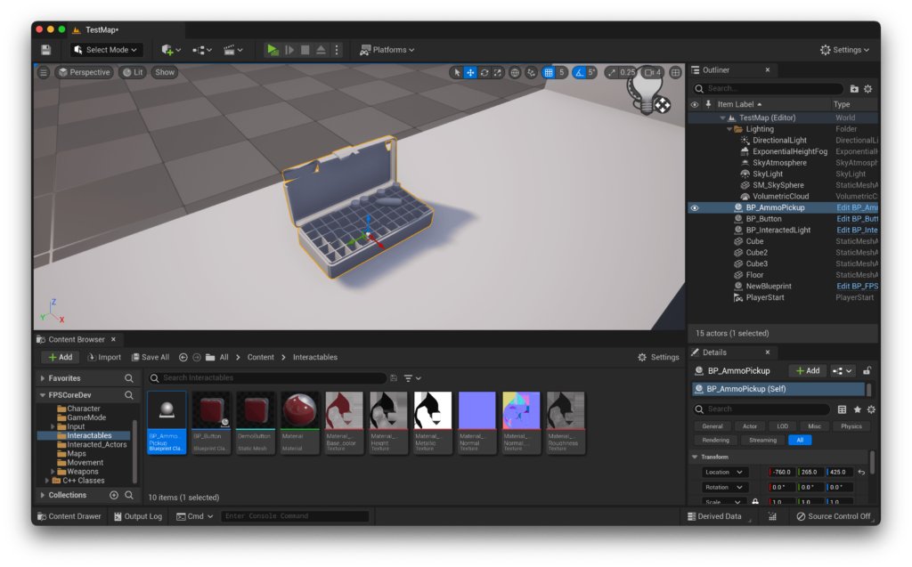

Now that we've set up our weapon systems, it's time to make it so that we can actually replenish our ammunition! FPS Core comes with an included AmmoPickup class that handles all of this for you, so let's learn how to set it up :D.

> Make sure that prior to attempting this guide, you've completed **QuickStart! Part 1** and **Part 3**, as these include setup of the interaction component and character controller that are dependancies for this system to work.

Like with previous tutorials, this one is reliant on some assets! You're going to need a set of models to represent the various types of ammo box and their various states. You can find the assets that i'm going to be using today at the link below!

[Ammo Pickup Models](https://emmadocs.dev/wp-content/uploads/2022/10/AmmoPickupModels.zip)[Download](https://emmadocs.dev/wp-content/uploads/2022/10/AmmoPickupModels.zip)

If you'd like to use your own models, the system is quite flexible, as models aren't really used for anything except display purposes. For the best results, i'd recommend having multiple models for different ammunition amounts, as well as having full/empty versions of the amount-specific models. However, this is just for aesthetic reasons, and if you really want, you can use the same model for every option and the functionality will be the same!

Let's hop in engine, and start by importing all of our models. We can import these with the default settings - we just need static meshes for this to work.

Now, it's time to create our weapon pickup class! Thankfully, FPS Core includes a stellar class that handles all the complex logic with weapon pickups called `AmmoPickup`!

Let's create a blueprint with this, and call it `BP_AmmoPickup`. If you open it up, you'll notice two data maps that we need to fill out, `Pickup Name` and `Ammo Data`.

`Pickup Name` is quite simple - it simply determines the name of the pickup that we can then access from our character for use in UI. Because this is different for each ammo type that our game has, we just need to tell the game what to display for each ammo type. You can fill these out however you want, here's what I did:

> If you're having issues adding new keys (and getting the error 'Cannot add a new key to the map while a key with the default value still exists'), you'll have to change the value of the key to something other then the default, add another value, change it away from default, etc. Unfortunately, unreal is just dumb in this.

Now, we get onto the big boi data, `AmmoData`. Let me break down `AmmoData` for you a little bit: It contains a further 3 maps, this time for the meshes for full and empty states, and finally how much ammunition each of those 'boxes' actually contains.

If we look into it, one of these ammo types looks like this

As you can see, this gives us space for 3 models. How convenient then that the sample assets include 3 models!

Let's start with the rifle ammo.

You can follow the screenshot below, but try to understand what's going on - Each ammo 'amount' (high/medium/low) gets assigned a model for when it's full and when it's empty, and then finally the numerical amounts of ammo that actually get added to the player's ammo supply.

You'll notice that the supplied models have the ammunition amount as a suffix (\_10, \_24, \_38). This is for detail - i've gone ahead and placed that amount of bullets/shells in each relevant ammo box so that their appearance is accurate in game, but you don't need to match these in your `Ammo Counts` map.

When the player interacts with the ammo pickup, the relevant ammo amount is added to their inventory, and then the full model is swapped for the empty one.

Let's repeat this for the pistol now. You're welcome to follow along, but i'd say try it yourself and then check back here to make sure you set it up correctly! :D

As you might expect, the setup for the shotgun ammo looks very similar:

The keen eyed amongst you will have noticed that in the case of `Special Ammo`, we only have one model for full, and one for empty. This is here to demonstrate that you can sort of 'hijack' the pickup system however you'd like. In the case of special ammo, i'd only like there to be one size of ammo that awards 2 bullets to the special ammo counter. As such, i'm going to set all the full meshes to the same full mesh and all the empty meshes to the same empty mesh. Then, i can set all the ammo counts to '2'.

Like this, we can make a constant ammo pick up.

That's it though! It's a big data structure to set up, but now we have the ability to easily add ammo pickups to our level! You can simply drag the blueprint into the scene now, and you'll see it immediately spawn an ammo pickup!

If you now go down to the details panel of any pickup actor, you'll see 3 options.

- `Ammo Amount` determines which of the 3 predetermined ammo quantities this pickup should have

- `Ammo Type` determines which type of ammo this pickup should represent

- `Infinite` determines whether the pickup should be emptied upon use or not - a negative value means we should empty the pickup

In the editor, you should get an experience similar to this:

So there you have it! You can now interact with this using the interact key we set up in [Part 1](https://emmadocs.dev/fps-core/quickstart-part-1-creating-a-character/), and it will add the relevant amount of ammo to your inventory! If you're having trouble with any of this, don't hesitate to hop into the [support discord](https://discord.gg/MzxdZd2WqR) to get some help :D

Stay tuned for the next part of **QuickStart!**, which will cover setting up weapon attachments! Until then! ~
