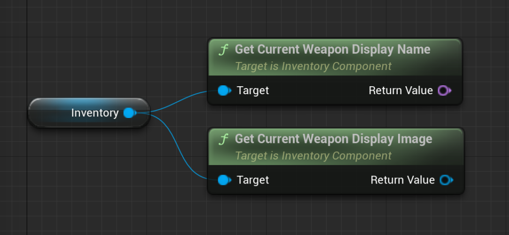
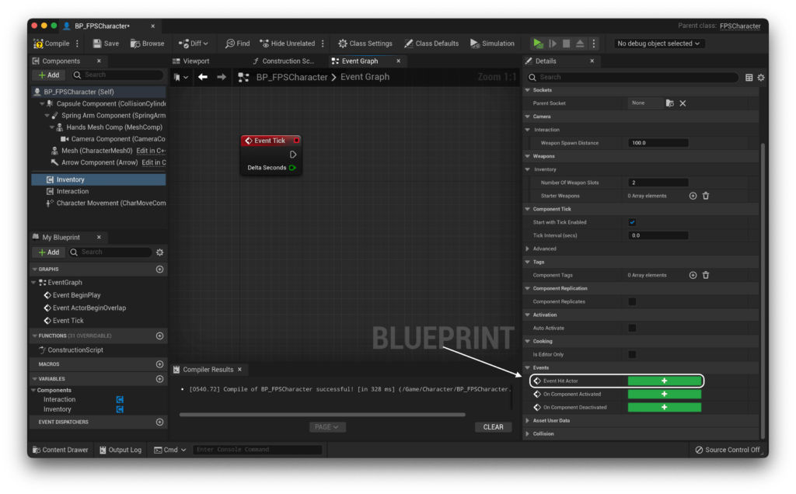
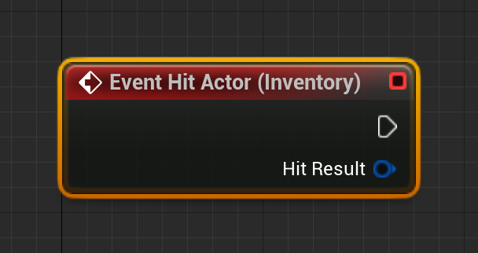
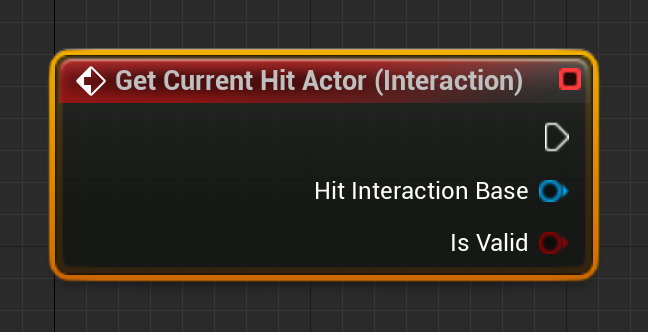

At long last, Update 0.1.4 is available in epic games launchers around the world! You can now update to 0.1.4 and enjoy all the new features - let's take a look at those now!

## New Variables

If you look in certain classes, you'll find new variables for you to edit! The player character contains a new slide angle variable, custom FOV offset, and a new vault space height variable, which we'll discuss later!

You'll also find new text and image values in data tables that use the `StaticWeaponData` row structure.

## Weapon representations for UI

That leads us nicely into the new additions to the UI system! You can now set **Names** and **Images** per weapon, letting you include these things in the UI! To access them, you can use two new functions found in the `InventoryComponent`, `GetCurrentWeaponDisplayName` and `GetCurrentWeaponDisplayImage`, also shown below.

You can use these to build more beautiful, informative UI in your HUD, or other related screens :)

## Spawning with weapons

You can now start the game with weapons already in your inventory! Inside the `InventoryComponent`'s default settings, you'll find a new array called `StarterWeapons`. You can fill this up with weapons, and the game will populate all the available slots with weapons, starting from the beginning of the array. This means that if you have 2 weapon slots (set with the `NumberOfWeaponSlots` variable), but 3 weapons in the `StarterWeapons` array, only the first 2 will be spawned and added to the player.

## New Blueprint-Accessible functions

You now have access to a handful of new functions that allow you to extend the functionality of FPS Core to a whole new degree. These are essentially a test-bed for how many functions will be extendable in 0.2.0. For now, you'll be able to get access to two of these functions, found in the `InventoryComponent` and the `InteractionComponent`.

### `InventoryComponent`

`InventoryComponent` now has a new event within it, called `EventHitActor`. This is called each time that a shot fired from the current weapon hits something, be that an enemy, a wall, or anything else in your scene.

You can add this to your scene from the events tab of the `InventoryComponent`

It looks like this in the editor.

### `InteractionComponent`

`InteractionComponent` gets it's hands on a new function called `GetCurrentHitActor`. This is called on tick, and returns the currently hit interaction actor, if it exists. In order to help with this checking, it also exposes an `IsValid` boolean pin to let you know if the value it's currently returning relates to a given actor, or whether it's simply `nullptr`. It looks like this in the editor.

Together, these are powerful tools to help you extend the functionality of FPS Core, and many more are coming in the future!

## Hold crouch is here!

Finally, you can choose to hold the crouch button instead of pressing it down! This functionality was originally restricted due to the sliding system, but it's now available for you to use in conjunction with sliding. With 0.2.0, you'll also gain the ability to disable sliding altogether, so this functionality will only grow! You can change to this new system with the new `CrouchIsToggle` boolean that you can find in the `Crouch` section of the `FPSCharacter`'s class defaults.

## Better vault checking!

You can now choose to check the height above the player as well as below when performing a vault! Set the required height above the player with the `VaultSpaceHeight` variable in the `Vault` category in the `FPSCharacter`'s class defaults.

## A whole bunch of smaller changes

Additionally, there are a whole bunch of smaller changes throughout, from optimisations and bug fixes to minor features and debug improvements.

# Migration guide

FPS Core 0.1.4 largely maintains compatibility with 0.1.3, with one minor exception. Rate of fire has moved to an RPM value, instead of a time-between-shots value. This means that if previously, you had your Rate of fire for a weapon set to 0.1, you'll now need to set that to 600 in order to achieve an equivalent rate of fire.

It's also worth changing from the old `PickupName` data structure in `AmmoPickup` to the new `PickupName` variable within the `AmmoData` data struct. Both of these are currently functional (though the engine will prefer an `AmmoData` pickup name) to maintain compatibility with older versions, but the `PickupName` map is now considered deprecated and will be removed in a future update.

* * *

That's it for 0.1.4! If you have any suggestions for future updates and content that you'd like to see, don't hesitate to let me know in the #suggestions channel of the [community discord](https://discord.gg/MzxdZd2WqR). You can check out the [full change log in the 0.1.4 list on Trello.](https://trello.com/b/TeeKaZr8/fps-core-roadmap)
