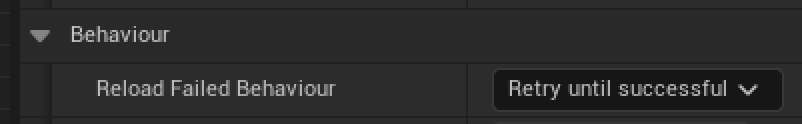
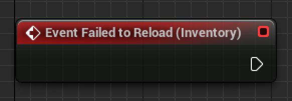
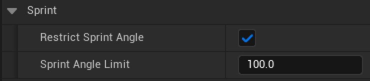
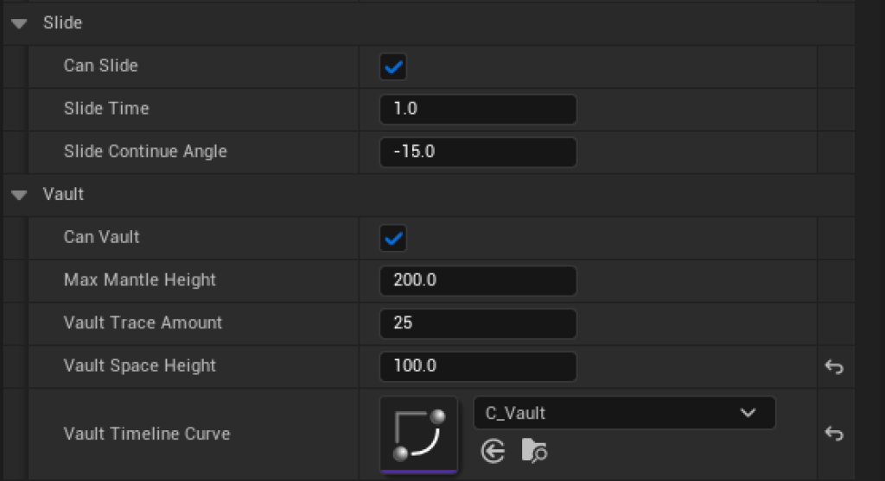
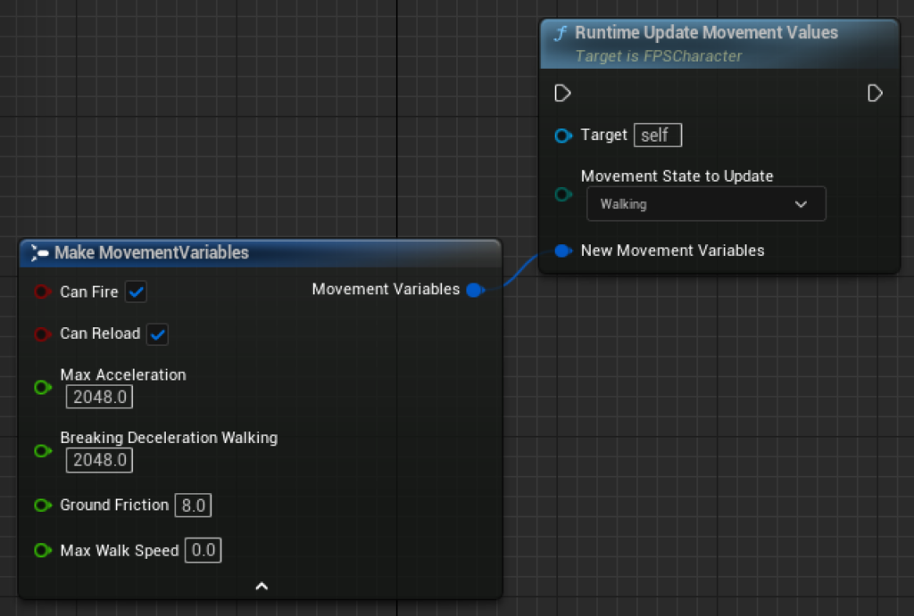
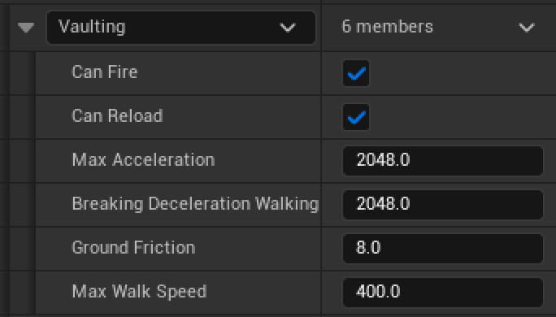
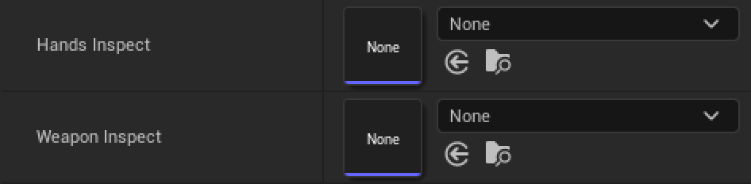
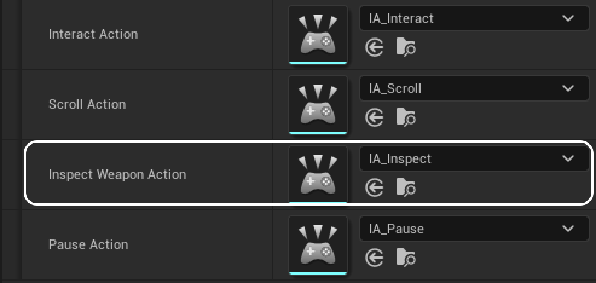

Update 0.1.5 has finally arrived! You can download it from GitHub and the Epic Games Launcher, and I can't wait to see what you'll do with it! Let's dig in to the new features :)

## Greater control over corner-cases

In the past, there were certain corner cases which could lead to undesirable behaviour for you and your players. One such example is trying to reload when in a state that does not allow reloading. In the past, this would simply not reload the weapon, while providing no indication that the weapon had not reloaded.

In v0.1.5, you'll find a new set of options under the InventoryComponent's `Behaviour` tab.

Here, you'll be able to pick between a number of ways to handle this behaviour:

- `Retry until successful` will repeatedly attempt to reload until the player's conditions fit an approved reload state, in which case the player will reload.

- `Change movement state to be able to successfully reload` does exactly what it says on the tin. The player will be transitioned into a walk state in order to reload.

- `Handle in Blueprint` allows you to implement your own logic here, such as displaying a popup on screen to let the player know that they haven't been able to reload.

- `Ignore unsuccessful reload` is the same as the default behaviour today, just ignoring the reload

<figure>

<figcaption>

The new `Event Failed to Reload` node that you can use to implement your own logic

</figcaption>

</figure>

This should give you a lot more control over the way reloading works. You'll also find another option in the `Behaviour` section, which is used to determine the behaviour of weapon swapping, namely what should happen when in the process of playing an unequip animation, the player swaps their weapon again. For now, there are only two options:

- `Swap to new values` takes into account new swap to values, allowing the current unequip animation to play and then switching the player to the last weapon they swapped to.

- `Ignore subsequent swaps` forces the player to swap to the weapon they initially swapped to, ignoring further weapon swaps until the weapon swap is complete.

Together, these tools give you greater control over edge-cases, and should help to smooth our gameplay.

## New movement options

In previous versions of FPS Core, it was possible to sprint in all directions, including backwards. You'll now have the ability to author the exact angle until which you can sprint, meaning that this should work with console (and any other analogue input) setups as well. You'll find these settings under the new `Sprint` tab

In the movement section, you'll also encounter new checkmarks to disable Sliding and Vaulting behaviour, which doesn't fit into a lot of experiences, and are finally getting an official disable toggle.

Since we're on the topic of movement, you'll also find that you can now edit the movement values of any movement state at runtime using the new `Runtime Update Movement Values` node, which you can find in the `FPSCharacter`.

This opens the door to new mechanics such as power-ups and gives you the option to include custom movement modifiers.

Finally, you'll also be able to choose whether the player is able to reload in any given movement state thanks to the new `Can Reload` toggle in the movement data!

## Weapon Inspect is here!

By popular demand, v0.1.5 includes a new built-in toggle to play a weapon inspect animation on both the weapon and the hands! You'll find two new animation slots in both the weapon and attachment data tables, which allow you to add your own inspect animations!

Naturally, you'll also need to set up some sort of input for this, and you'll find a new slot for an Inspect Weapon animation within the player character's input setup!

## More control over weapon firing

If you take a look into any weapon data table, you'll see a new option, `Prevent Rapid Manual Fire`.

This gives you the opportunity to prevent players from firing faster than your designated rate of fire by clicking rapidly. They'll now be restricted to the rate of fire that you've set - no more!

## Various bug fixes and improvements

- Fixed a bug that prevented weapon unequip animations from being played

- Fixed a bug that caused montages to keep playing after a weapon swap was performed

- Fixed a bug where the first shot of recoil was not being played correctly. First shot recoil should be much more consistent

- Fixed a bug with weapon pickups not displaying properly on the UI

- Fixed a bug with the `wait for anim` toggle which caused it to not work

## Migration guide

v0.1.5 is entirely compatible with v0.1.4, and doesn't introduce any breaking changes - you should be able to just grab the latest version and immediately start using the new features!

That's all for v0.1.5! The next major update will be v2.0.0 (which, as you can see, will come with an updated semantic versioning style) and include a number of larger features, but I'll be on the lookout for bugs and fixes that i'll try and introduce quickly in a potential update 0.1.6+.  
  
If you have any feature requests, you're always welcome to leave them in the [community discord](https://discord.gg/MzxdZd2WqR), or [email me](mailto:contact@emmadocs.dev)!
