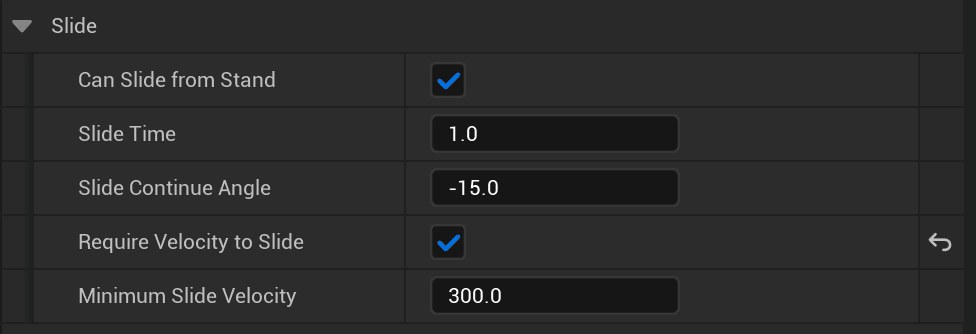

Update 0.1.8 is finally here! It features a lot of the changes initially intended for 0.1.7, most of which are 'common sense' improvements to existing systems, as well as some minor new features :)

## More choices with reload behaviour

The initial implementation of the reload behaviour mechanic was somewhat limited. You now have more flexibility when designing the reload behaviour for your games! You can fine-tune the behaviour of the `Retry until successful` and `Change movement state` behaviours, which feature new parameters.

You can read more about this in the now updated guide on this subject, found [here](https://emmadocs.dev/fps-core/how-to-use-reload-options/).

## New BP Node

You'll find a new node called `Set Movement State`, which allows you to, well, set the player's movement state. You can use this to build more complex custom mechanics and have greater control over movement state

## Reworked landing options

Previously, you were able to decide whether sliding was allowed or not, which would also effect the behaviour when landing after pressing the crouch key in the air. Now, these two systems have been split up, allowing you to manually disable sliding from stand, and then author what state landing behaviour transition to - either a slide, a crouch, or ignoring it entirely.

## Gun Fire animation for hands

You'll find a new slot in the animations section of the weapon and attachment data tables, ready for a new animation that plays on the hands every time a shot is fired. This will allow you to depict things like recoil in an easier way :)

You'll find the renamed `Weapon Shot` (formerly `Gun_Shot`) alongside it's new `Hands Shot` friend :)

## Required speed for sliding

You can now require players to be of a certain speed to slide, if the `Landing Behaviour` is set to `Slide`. In this case, we check that the player's velocity is greater than the set `Minimum Slide Velocity` before we allow them to slide. If it's not, we just ignore it and land in a standing pose. If you'd like more control over this behaviour, let me know!

You'll find all of these settings under the `Slide` section in the player character

## Migration Guide

All the new features are automatically compatible with previous versions of FPS Core, and you shouldn't experience any issues when moving over. The only thing to watch out for is that you may have to re-configure your landing behaviour as a result of the new features.

* * *

That's all for v0.1.8! Thanks for staying patient with this one. I'm moving on to production of FPS Core v2.0, which will come with very large, core changes to address some of FPS Core's key limitations, so I wouldn't expect many more 0.1.X releases, if any. I may do a v0.1.8 LTS release in the future, for those wishing to stay on the current platform, in order to provide bug fixes and stability improvements, although this may have to be GitHub only, since Epic does not allow me to ship two versions of the plugin at the same time (Maybe a separate legacy plugin on the marketplace could work? We'll also see how this evolves with FAB).

If you have any feature requests for v2 and beyond, you’re always welcome to leave them in the [community discord's #suggest channel](https://discord.gg/MzxdZd2WqR), or [email me](mailto:contact@emmadocs.dev)!
