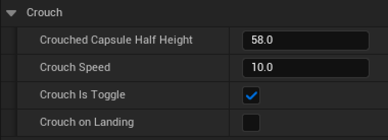

Update 0.1.6 is here! This is largely a bug fix update for the changes introduced with v0.1.5, which was not QA tested properly before release, a lesson which I'm carrying forward to this and future releases, which should receive much better QA.

## Authoring landing behaviour

The only new 'feature' you'll find in v0.1.6 is the ability to author landing behaviour when sliding is disabled. You'll find the new dropdown in the `Crouch` category, and it's called `Crouch on Landing`.

If this is set to true, the character will crouch on landing (hence the name) if you press the crouch key in mid-air. It's just a way of giving you greater control if you've chosen to disable sliding.

## 'Various bug fixes and improvements'

The all-too common phrase is true here, v0.1.6 features a number of bug fixes from v0.1.5, which you should notice with features like weapon swapping.... actually... well, working :p. I'm so sorry that my QA for v0.1.5 wasn't good enough, and I hope you don't run into any more issues with v0.1.6!

## Migration guide

Being a bug fix update, you should have no issues when updating to v0.1.6, just an increase in stability!  
  
If you have any feature requests, you're always welcome to leave them in the [community discord](https://discord.gg/MzxdZd2WqR), or [email me](mailto:contact@emmadocs.dev)!
